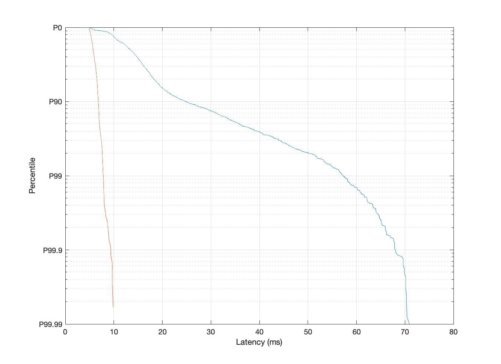

\newpage

**Executive Summary**

Placeholder text: When people think of Internet performance it is
typically solely in terms of speed. But when considering the end-user
quality of experience (QoE), latency is usually a key factor.
Unfortunately, latency is not well understood in the policy or
regulatory spheres or by the average consumer. This paper will explain
and explore latency, including idle latency, latency under load,
components of latency performance, how latency varies by access
technology and/or protocol, and how latency can affect the user QoE for
certain types of applications such as video conferencing, remote
learning, gaming and more. As well, while the FCC MBA program reports on
latency it takes no position on what is good or bad latency — a question
this paper will explore. Additionally, this paper will examine metrics
for characterizing latency performance, including various summary
statistics for latency and latency variation (often referred to as
"jitter"). Finally, the paper will look to the current state of the art
and the future to explain Active Queue Management (AQM) and other low
latency services — and the new types of applications that this may
enable in the future.

\pagebreak


# Introduction 

Today when people think of end-user Internet performance,
it is typically solely in terms of "speed" -- the aggregate capacity of a
home's Internet connection. Recent debate in the U.S. about improving
performance has as a result centered around the potential benefits of
moving to symmetric gigabit connections
[https://www.eff.org/deeplinks/2021/07/future-symmetrical-high-speed-internet-speeds]
or dramatic increases in upstream speeds
[https://arstechnica.com/tech-policy/2021/03/100mbps-uploads-and-downloads-should-be-us-broadband-standard-senators-say/]
as a tool to solve performance problems, particularly with interactive
applications such as video conferencing that have seen recent mass
adoption as a result of the COVID-19 pandemic
[https://www.bitag.org/documents/bitag_report.pdf]. This primary focus
on speed has been consistent with the Internet industry's approach for
more than twenty-five years that simply increasing speed was the best
way to improve performance (or "Quality of Experience") for the end user.

But over the last decade, the industry, including protocol developers
[refs], researchers [refs], operating system developers [refs],
application providers [refs], Internet Service Providers (ISPs) [refs],
and standards development organizations
[ref to recent IAB workshop report and IETF TSV WG materials] have
slowly begun to recognize that for the majority of applications 
in use today and envisioned in the near future, 
another key factor, “latency”, can have a much bigger impact on 
Quality of Experience (QoE). Latency performance is critical to any application
involving user interaction, from web browsing to video streaming and
everything in between. As this is a recent development, it has meant
that latency is not well understood in the policy or regulatory spheres
or by the average consumer — or even by many in the industry. One of the
reasons for this has been that the way in which network latency has 
historically been measured, and the metrics used to describe latency 
performance were flawed, and have very little to do with
end-user QoE.

## Examining Latency

While latency may sound technical or complicated, what it represents is
quite simple: latency is simply *delay* 
(and we'll use the two terms interchangeably in this report).  Latency 
can be considered at the application level 
— such as the time between a user clicking a link in a browser, and 
for the resulting page to be displayed, or it can be considered at 
the network level — such as the time that it takes for the HTTP request 
message generated by the browser to make it to the server that will 
eventually return the corresponding data. Network latency 
can be considered on a one-way basis (upsteam or downstream) or a
round-trip basis (both directions). 
This network level delay is what we focus on in this report, since 
it (along with bandwidth and packet loss) end up resulting in the 
latency experienced by the user at the application level. 
The less delay that a network or
application has, the more “responsive” a service will feel to an end
user. The more delay (or lag), the worse it will feel, and every user is
familiar with user interface cues that reflect this — such as a spinning
wheel to communicate waiting or buffering. Having low delay is centrally
important to any application involving a user interacting with a device
or application, and will become ever more so as new cloud-based
applications, augmented reality, virtual reality, and other new
application classes emerge. Critically, however, reducing delay 
will *meaningfully improve all existing user applications*.

In addition, it is also important to have a *consistently responsive*
service where delay stays consistently low no matter how heavily
utilized a user’s Internet connection may be and no matter what mix of
applications are being used. Another way of saying this is that delay
should not vary by much; the less variability the better. If this is not
so, as is often the case on the Internet today, then delay can vary
wildly from very good to very bad. To an end user that variability ends
up being very confusing — one moment their network and applications
appear to perform well and the next moment they do not. They 
(and, frankly many network engineers)
often just
accept “that’s how the Internet works” and while there was a bit of a
hiccup one moment everything seems okay now, so they ignore this oddly
variable performance. Network engineers use the term “jitter” when
describing the variability of latency, which we will use and explain
later in the report.

The main test of latency today, the results of which are listed in
reports such as the FCC’s Measuring Broadband America (MBA) report
[see Section D of the 10th FCC MBA report at https://www.fcc.gov/reports-research/reports/measuring-broadband-america/measuring-fixed-broadband-tenth-report],
are really what is becoming better understood as a test of *idle
latency*. Such an idle-latency test is typically performed by sending a
small number of ping[^1] packets from a home to a destination server on the
Internet and reflects the average round trip time (RTT) for each packet to travel
to the server and back. However, these tests are typically performed
with no other meaningful traffic utilizing the end user’s Internet
connection at the exact moment of the idle-latency test, and they 
discard the (often times significant) variation in RTT from one packet 
to the next. As a result, it
does not reflect the end user's real-world latency performance when they
use their Internet connection.

[^1]: ping is discussed further in [Ping (ICMP)]

Idle latency tends to reflect nothing more than the inherent
attributes of different access network technologies and the 
distance between the client and the measurement server.  Aside 
from outliers like satellite broadband and certain Digital Subscriber 
Line (DSL) connections, access network technologies generally only have minor
differences in the way that packets are handled that do not have a significant impact on end-user
QoE. In contrast, differences in *working latency* can be significant
and that measure is more directly representative of real-world
performance. Idle latency can therefore be considered a mildly
interesting reflection of access network technology and network topology
but when it comes to how end users experience the Internet it is nothing
more than a measurement of a connection when it is not being actively
used and is therefore essentially meaningless to end-user QoE. *To
really understand end-user QoE, we need to look at working latency
rather than idle latency.*

When a longer duration test of latency is run at the same moment that
the Internet connection is being utilized, this is a test of working
latency. Working latency is therefore a better reflection of the
real-world performance of an end user’s Internet connection. The
difference between idle latency and working latency can be significant —
on the order of hundreds of milliseconds to several seconds. That is the
difference between a player losing an online game, between a good and
bad video conference experience, between slow start of video streaming
playback and instant playback, etc. The differences between working
latency from one network to another and one user to another at the
current time are significant and bear as directly on end-user QoE as
connection speed.

A test of working latency typically involves running a speed test (a
large file transfer) to fully utilize a connection while in parallel
running a series of ping tests to a destination server. This will show
the packet delay when a connection is in use, reflecting real-world
performance. To best measure what performance a user might expect,
working latency tests don't simply report the average latency experienced,
but instead focus on the maximum (or perhaps the 99th percentile) of the 
latency measurements, along with the minimum value. These two values 
represent the range of packet latencies that the user's applications will
need to deal with, and provide the best reflection of the expected QoE.  
Other metrics, such as average latency or standard deviation of latency 
are not considered particularly useful.   

To summarize, idle latency is interesting but on its own does not
sufficiently predict end-user QoE, while in contrast working latency
is centrally important to that QoE. If both the idle latency and the 99th
percentile working latency are kept low, a user will
perceive a service as being consistently responsive to their application
needs and experiences. *The best Internet connection will have high
throughput (high speed), low delay (low latency), and consistent delay
(low jitter).*

## Causes of Latency

But what causes poor working latency? The best way to understand that is
to first envision the end-to-end path from a user to a destination
server. `can this be a figure instead:` __A user has a device such as a
laptop or mobile device, which connects to their Local Area Network
(LAN, often connected via Wi-Fi), to some Customer Premises Equipment
(CPE) like a home router or cable modem gateway, to an Internet Service
Provider (ISP) network and across that network, then across one or more
interconnection points between to networks to a destination network, to
network devices in a destination data center (e.g., router, load
balancer, switch), and eventually to a destination server.__ Along this
end-to-end path, the link with the least capacity in the upstream and
downstream direction (which may be different for each direction) is the
most constrained link, and is typically referred to the “bottleneck
link”. This bottleneck link — and there is always a bottleneck link on
any path — requires a buffer of some sort to moderate the high flow of
packets coming into a link with the lower flow of packets that the next
link in the path can accept. Thus, the buffer, or queue, in that
bottleneck link can contribute significantly to latency.

A good way to envision a buffer is to envision pouring water into a
funnel that has a wide top (lots of bandwidth capacity) and a narrow
bottom (lower bandwidth capacity). As a large volume of water enters the
funnel, at some point the incoming water flow is greater than can be
drained at the bottom and the water level begins to rise — so a buffer
of water forms and the water line in the funnel begins to rise. When
water rises over the top of the funnel and spills out (akin to packet
loss), this may be a signal for someone to slow the rate of incoming
water flow. Or the person holding the funnel may tell the person pouring
water to slow down (akin to congestion notification). Whether as a
result of noticing water spilling over the top of the funnel or
receiving a signal from the person holding the funnel to slow down, the
person then begins to reduce the volume of their pour. As the incoming
flow of water moderates, and the volume between input and output
equalizes, the water level in the funnel (buffer) can then begin to
drain.

There will always be a constrained link on an Internet path, due to its
packet-based design which means in part that it does not create
end-to-end circuits with dedicated capacity. As a result, the presence
of a bottleneck link and a buffer is not good or bad — it is merely a
fact of the design of the Internet. As well, the fact that some packets
are lost at this bottleneck is also completely normal and indeed is
essential, as this is a key part of the control signal or feedback loop
to a sender to moderate how fast they are sending packets. Without
trying to send at an increasingly higher rate, a sender would otherwise
never be able to discover and fully utilize the maximum capacity of an
end-to-end path, nor adjust to take advantage of new capacity as it
becomes available. Thus, what’s critical is not that a queue exists or
that packet loss will occur — it is how that buffer or queue performs
and how quickly it can react to and communicate changing conditions.

Network engineers refer to how a buffer performs as “queue behavior”.
The predominant and most basic way to manage the behavior of a queue
today is First-In First-Out (FIFO), which is easy to understand
[ref to FIFO queue management]. But newer forms of queue management,
such as various types of Active Queue Management (AQM) (discussed
further in [Active Queue Management]), have started to emerge in recent
years that can dramatically improve the responsiveness of these network
queues and therefore dramatically lower working latency.

This paper will further explore all of these topics, from a deeper dive
into latency measurement to the newest forms of AQM and where that AQM
is best deployed.

# Definitions

## Throughput vs. Speed

It's important that we first make a point concerning the difference
between what network engineers describe as the "throughput",
"bandwidth", or "capacity" of a network connection and what the
layperson thinks about as the "speed" of a connection. When we describe
a link capacity as 100 megabits per second, or 10 gigabits per second,
or 1 terabit per second, that refers to the *amount* of data passing
through a given point (such as a home's Internet connection) per second,
not how *quickly* that data travels to its final destination. Thus,
numbers expressed as "bits per second" are best understood as a measure
of throughput, bandwidth, or capacity, and not speed (and this is why
one correct term is band-width and not band-speed).

(JL NOTE: Is this analogy useful or can it be deleted or modified?) To
illustrate this with a simple analogy, imagine increasing the bandwidth
is like adding more lanes to a highway — it makes the highway wider, so
it can carry more cars, but it doesn’t change the speed limit at which
the cars may travel. Counting cars-per-minute passing a certain point on
a highway tells you about the capacity (or width) of the highway, but it
tells you nothing about the speed of the individual cars. Similarly, on
this road there may be a motorcycle and a tractor trailer truck
traveling at the same speed in traffic, and so while the truck has
higher cargo *capacity* than the motorcycle, it won’t get you to your
destination any *faster* than the motorcycle.

## Latency vs. Throughput

Latency and throughput are two distinct characteristics of a path
between a sender and a receiver, and they are largely unrelated to one
another, but not completely so - they can influence one another. As
we'll describe later, some existing network protocols are unable to
achieve high throughput when there is significant latency present. So,
high latency can reduce the apparent throughput from the user's
perspective. Additionally, increasing the throughput of the path (e.g.,
from 10 Mbps to 1 Gbps) can reduce latency in some cases. One case where
this can happen is with latency degradation due to *load* on the path.
For example, a single video stream at 5 Mbps might cause queuing delays
50% of the time on a 25 Mbps connection, but only 5% of the time on a
100 Mbps connection. To be clear, this is a case of reducing the
frequency with which a latency degradation occurs, not the severity of
it. In both example cases - a 25 Mbps connection and a 100 Mbps
connection - latency could be severely disruptive, just less often so
with the higher throughput connection. Another case where increasing
throughput can impact latency is when the queue/buffer is statically
sized (e.g., as a number of bits or bytes), resulting in a larger
buffering delay on lower throughput connections. This phenomenon,
queuing delay, is important and is discussed in some detail in this
report.

## Latency

Network latency is a core characteristic of any network path, including
end user broadband connections to the Internet, paths between two
servers in a Content Delivery Network, paths between two enterprise
network locations, and so on. This paper more narrowly focus on latency
as it pertains to end users, however, and so we will focus in on latency
as it relates to a broadband service, because this has a significant
impact on how well applications generally work over the Internet. There
are certainly a wide variety of other latency variables that
significantly affect end user QoE but many of those have already been
broadly addressed and optimized by network engineers. One example here
might be the role that Content Delivery Networks (CDNs) play in
performing "content localization", whereby users are directed to server
destinations that are closed to where they are located - which means
they have a shorter end-to-end path and thus lower latency to access
some content.

Latency has been an accepted performance metric of interest since the
inception of modern data communications based on digital technology.
Stated formally, network latency represents the time that it takes for
data packets to travel from one network host to another network host.
Since data packets cannot instantaneously be sent from the source to its
destination, the network latency metric provides a measure of the total
delay experienced by the packet as it is transmitted through many
different network nodes along an end-to-end path in order to arrive at
its intended destination. For residential ISPs, this metric can often be
further focused to separately measure downstream latency and upstream
latency to gauge network delays encountered in sending data in the
downstream direction through the network to the end user, or in the
upstream direction from the end user into the core network,
respectively.

The network latency encountered in nominal or light usage conditions is
known as the idle latency of the network. The latency between a laptop
and the next hop of a packet on the LAN will typically be quite short.
As you add successive network hops from the laptop to the home gateway,
then the ISP network, and all the way to the destination server, the
latency will increase as each new link in the chain is added. But,
because each link may introduce a different amount of latency, a large
number of links in and of itself doesn't necessarily mean high latency.
This is because some links can be quite short, such as a fiber link
between a switch and a server in a data center, while other links can be
long, such as an east-west fiber link across the U.S. And physical media
such as fiber is limited by the physics of the speed of light. This
means that, generally speaking, latency increases as distance increases:
the time to send a packet across town will be less than the time to send
a packet across the country.

Latency also varies by different types of physical media or type of
network (e.g., type of ISP access network technology). For example,
looking at the physical media, inside a datacenter for example, a
gigabit fiber connection will typically have lower latency than a
copper-based 10 Mbps Ethernet connection. In addition, the latency
properties of ISP access network technologies will also cause latency to
vary — this subject is discussed futher in the next section. As a
result, idle latency tests of an end-to-end path will simply reflect (1)
distance and (2) underlying network technologies. This is the baseline
latency that is the starting point for understanding real world end-user
performance (QoE).

Critically however for this paper, latency also varies - and
significantly so - based on underlying network conditions. That means
that latency may increase as traffic volume increases or as the capacity
of a connection fills up. It can also mean that latency varies as a
result of a mix of different kinds of traffic on the network (e.g., bulk
downloads and online game play). When adding in real traffic of any type
and volume, we can then see how the network reacts under real-world
conditions and understand the so-called "working latency" of the path,
also sometimes knows as latency under load (LUL).

Thus, to effectively measure what end users really experience, it is
essential to measure working latency rather than idle latency. Indeed,
the problem with idle latency measurements is that they fail to reliably
measure network performance when working traffic loads are present on
the network, which can result in misleading characterizations of the
network delays present on the network when it is operating under normal
load conditions. Working latency measurements taken when network traffic
is present provides a more realistic measure of network delays
experienced by users.

# Sources/Contributors to Latency

As discussed above, latency is a property of the end-to-end journey that
a packet takes from its source to its destination. As a result, the
latency that any individual packet experiences is influenced by all of
the processes that are involved in handling that packet, from the
instant that the sending application generates it, until it is
successfully received by the receiving application. This includes
processes in the sender itself, as packets are handled by the operating
system and the network interface; the properties and *state* of each
network element and link that is involved in forwarding the packet; and
the processes in the receiver that are involved in delivering the packet
from the network interface, to the operating system, and then to the
application. All of these aspects accumulate to result in the overall
end-to-end latency that the packet experiences.

This section provides an overview of these processes and properties with
a particular focus on the factors that have a material effect on the
end-to-end latency. We start with some of the properties of the network
hops themselves, then discuss the phenomenon of buffering delay (which
is driven by the sender behavior as well as the properties of the
network), we move on to cover aspects of path selection and core network
topologies, then mention additional latency factors that are introduced
by the endpoints (sender and receiver).

But as noted above, it is easy to misunderstand the source of latency.
If you imagine a user with a 1 Gbps symmetric broadband connection that
is communicating with a server that is relatively close by, it is
certainly possible that the end-to-end path is entirely fiber-based and
yet latency can still be an issue. Unlike cars on a road, which have
human drivers that slow down when they encounter heavy traffic, photons
traveling through glass fiber move at a constant speed (the speed of
light). Photons do not slow down because there are other photons ahead
of them in the fiber. So, if photons travel at a constant speed and
never slow down, how do computer networks experience congestion that
slows down the responsiveness of the network and degrades user
experience?

The answer is that delays in computer networks do not occur in the
cables; they occur in the packet switching equipment that connects the
cables (i.e., routers, access points, network cards, operating systems).
When a data packet arrives in a piece of switching equipment, and the
cable on which the packet is supposed to depart is already busy, the
data packet has to wait its turn. If there are many other packets
similarly waiting, the data packet may have to wait a significant amount
of time (and either be held for that wait time in a buffer or discarded
as packet loss).

## Link technologies in place along the path

The link technologies in the path contribute latency due to the distance
the signals travel (length of the physical medium) relative to the speed
at which signals are transmitted on the physical medium (propagation
delay), the time it takes for equipment to encode and decode the
physical and link-layer technologies, characteristics of how bits of
information are encoded on the physical medium, and switching and
queuing delays caused by nodes needing to combine and send inbound
traffic on outbound links.

Each hop along the path introduces latency due to a number of factors:

- **switching/forwarding:** the time it takes to process the packet
header, check for bit errors, decide whether to forward the packet (and,
if so, to which interface) or to discard it, and any other manipulation
of the packet that takes place in the device. This delay is typically
minimal, and providers of core networks will often further minimize this
by using technologies like MPLS that have very simple packet headers.  

- **propagation delay:** the time it takes for a bit of information to
travel across the link. This is driven by the propagation velocity of
the medium and the length of the link. It is immaterial for home network
and access network links, but can become significant for long-haul
backbone links. More detail is provided in
[Appendix B: Propagation Delays of Commonly-Used Networking Media].  

- **serialization/encoding:** the amount of time that it takes for the
transmitter to finish sending the entire packet on the link, from the
first bit until the last bit. Aside from features such as time-based
interleaving utilized by some link technologies, this is negligible.  

- **media access delay:** the delay incurred due to arbitrating access
 of multiple devices to a shared medium. This is seen in some home
 networking technologies (e.g., powerline, coax, phoneline), some
 wireless technologies, DOCSIS, and some PON implementations. 
 In addition, some link
 technologies support the retransmission of packets lost due to noise
 and interference. This feature enables a lossy link (e.g., a wireless
 link) to achieve acceptable packet loss rates, but results in
 additional latency to complete the loss detection and retransmission
 process.
 Media
 access delays can range from less than a millisecond to tens or even
 hundreds of milliseconds.  

- **buffering delay:** also referred to as
 queuing delay, this is the time packets wait in a buffer or a queue in
 the network element while other traffic is being transmitted. The
 buffering delay is variable, depending on instantaneous traffic load,
 and can range from 0 to the maximum supported (or configured) in the
 node. This can sometimes be the largest source of delay and delay
 variation. Unique buffering characteristics of some link technologies
 are discussed below, and buffering delay in general is discussed in
 [Buffering delays]. *Note, the term "buffering" is also commonly used
 to refer to the time that a streaming media application (e.g., a
 streaming video player) appears to wait while it builds up an amount
 of data in its playout buffer, before it begins playing the media.
 This is an entirely different phenomenon, and is not what we refer to
 as buffering in this report.*    

- **miscellaneous, link specific:** some link technologies can introduce
additional delays that can be significant. Some of these are discussed
below.  

There can be significant latency differences between access and home
network technologies due to these factors. The following table
summarizes some of these differences.

  Technology  |   Notes
--------------|-----------------------------------------
Ethernet      | -
Wi-Fi         | media access can be >45ms, scanning introduces latency spikes
G.hn          | latency varies per # of nodes 
DOCSIS        | media access: 2 - 8 ms, recent versions reduce buffering delay
DSL/G.fast    | interleaving adds 2 - 20 ms if enabled[^bhs1]
xPON          | media access delay is system dependent   
LTE/5G        | LTE incurs session setup delays


[^bhs1]: The ISP controls whether or not interleaving is enabled and how much interleaving delay, if enabled.

The next subsections discuss some nuances of the various link technologies that impact latency performance.

### Ethernet 

Ethernet links, whether the familiar 1 Gbps LAN cables used to connect
devices in home networks and offices, or the 10G, 100G, 200G, 400G
optical fiber versions used in datacenters and to connect sites over
long distances, form a baseline against which most other network link
technologies can be compared. Historically, the Ethernet standard (IEEE
802) set the maximum size of a packet to be 1500 bytes (to which it adds
18+ bytes of framing). This *Maximum Transmission Unit* size has been
adopted by many other link technologies as well, and thus has become the
de facto MTU for the Internet.

The latency introduced by an Ethernet link has two components that can
be directly calculated from the frame size and the characteristics of
the link (speed, distance and medium). For example, a 1518 byte frame
(12144 bits) sent via a 1 Gbps interface over a 100-foot copper twisted
pair (e.g., Cat6) cable will experience 0.0121 ms (12144 bits / 1e9 bps)
of *serialization delay* (the amount of time it takes to transmit all of
the bits of the frame), plus 0.00017 ms (100 ft / (0.59 * 1,000,000
ft/millisecond)) of *propagation delay* (the time it takes for each bit
to make it from the transmitter to the receiver), for a total latency of
about 0.0123 ms.

In addition, an Ethernet *network* (i.e., multiple Ethernet links
connected via switches) introduces delays at each switch. The delay
added by each switch also has two components: *switching delay*
and *buffering delay*. The switching delay can be negligible in
"cut-through" switches, or can add an amount equal to the serialization
delay in "store-and-forward" switches. The buffering delay is variable,
depending on instantaneous traffic load, and can range from 0 to the
maximum supported by the switch. Many switches used in datacenters are
"shallow-buffered" such that the maximum buffering delay is on the order
of hundredths of milliseconds, though deep-buffered switches exist as
well, supporting maximum buffering delays in the 10s of milliseconds.

### Wi-Fi

While appearing to the network as if it were an Ethernet-based device,
Wi-Fi is very different in that it not "switched" as is modern-day
Ethernet. Rather, it is more like early versions of Ethernet where only
a single transmitter at a time is allowed, with more sophisiticated
arbitrage of the basic transmission opportunity (TXOP) than original
Ethernet.

Potential transmission delays in Wi-Fi can have a range measured in
seconds, while competing with other devices and access points on the
same channel, coping with transmission errors and subsequent retries,
and effective transmission rates can vary also from below 1Mbit to 1Gbit
as a function of these problems and of (especially) the distance to the
receiver. Additionally, many Wi-Fi interfaces periodically shut down
temporarily to scan for other available channels, resulting in periodic
latency spikes while packets queue up until the link is available again.

Newer standards for Wi-Fi attempt to improve multiplexing behaviors
while remaining compatible with older Wi-Fi standards, but co-existing
on the same spectrum is difficult. Standardization on more and different
spectrum is aiding improvements to Wi-Fi behaviors.

### Powerline Carrier (PLC)  

Several physical-layer technologies have been defined for use on
powerlines. While powerline has been explored for broadband access, it
is not widely used as an acces technology in the United States. The
dominant PLC technologies for use in a LAN are HomePlug and G.hn
(standardized by ITU-T). Latency due to speed of transmission and
distance are negligible on the short LAN loops where PLC is used.

HomePlug products are still being deployed in LANs, but the HomePlug
Alliance (which provided advocacy and certification) is no longer
active. There is no interoperability among the various HomePlug silicon
solutions and no detailed specification of the technology. Measurable
latency has been noted in some HomePlug networks, which suggests some
HomePlug products may make use of time-based interleaving.

G.hn does not use time-based interleaving. In addition to operating on
powerlines, G.hn is also often used on coax and twisted pair and is
being deployed in some Multi Dwelling Unit (MDU) environments to provide
broadband access to individual units.

### DOCSIS
	
The Data Over Cable Standard Interface Specifications (DOCSIS) are
standards for hybrid fiber-coaxial (HFC) networks (ADD FN:
https://www.cablelabs.com/specifications). Most DOCSIS networks today
are comprised of primarily DOCSIS 3.0 and 3.1 cable modems and DOCSIS
3.1 Cable Modem Termination Systems (CMTS). Most HFC networks use
coaxial copper cable for the last few hundred feet, and fiber optic
cable for the remainder of the distance between the CMTS and cable
modems, followed by fiber optic cable from the CMTS to the Internet.

A DOCSIS link is a shared medium.  In the upstream direction, multiple cable modems request access to a particular transmission channel, and access is scheduled by the CMTS.  In the downstream direction, all transmissions are scheduled and made by the CMTS.  As described in Section 1 of [@LLD] there are five sources of latency in DOCSIS 3.1 networks (and similarly DOCSIS 3.0).  These are:  

Delay Source | Range -------------|------ switching/forwarding | < 0.04
ms propagation | 0.02 - 0.6 ms serialization/encoding | 0.4 - 3.5 ms
media acquisition | 2 - 8 ms queuing | 0 - 200 ms

DOCSIS 3.1 equipment has multiple features to manage queuing latency (some of which are available in DOCSIS 3.0 equipment as well), including Active Queue Management (AQM), and a new feature called *Low Latency DOCSIS* which includes support for the *Low-Latency Low-Loss Scalable Throughput* (L4S) architecture and isolation of Non-Queue-Building (NQB) traffic. AQM, L4S and NQB are discussed later in this document.  

The expected latency performance of these latency management features
(as given in Table 1 of [@LLD] in order-of-magnitude numbers) is:

Feature | When Idle | Under Load (Working Conditions) | 99th Percentile  
--------|-----------|------------|----------------  
Buffer Control | ~10 ms | ~100 ms | ~100 ms
Active Queue Management | ~10 ms | ~10 ms | ~100 ms
Low Latency DOCSIS 3.1 | ~1 ms | ~1 ms | ~1 ms

 
### Digital Subscriber Line (DSL) and G.fast

ADSL, ADSL2+, VDSL, VDSL2, and G.fast are "last mile" broadband access
technology standards defined by ITU-T. All of these are primarily
defined to run over twisted-pair copper wires, although G.fast can also
run over coax (which is useful in some multi-dwelling unit deployments).
The older Asymmetric Digital Subscriber Line (ADSL) technology was
generally used on loop lengths of 1 mile or less. The newer ADSL2+, Very
high-speed DSL (VDSL) and VDSL2 technologies are generally used on
shorter loops in a fiber to the node (FTTN) configuration (with copper
to a node and fiber from the node to the central office). Since copper
is a very efficient transmission medium, the time for a signal to travel
these distances is very small and does not contribute significantly to
latency. Encoding and decoding DSL signals does add some small latency.
But this delay is also very small.

Some ADSL2+ and VDSL deployments used a time-based interleaving
technique (see [https://kitz.co.uk/adsl/interleaving.htm]) to be more
resilient against noise on the line. Noise can result in lost bits of
data. With interleaving, it is often possible for the ADSL2+ or VDSL
receiver to recover these lost bits. If lost bits are not recovered, the
loss can result in either missing information (e.g., clipped sound in an
audio transmission) or cause the data to be retransmitted (which causes
delay). But time-based interleaving adds delay to accomplish this
resiliency. Common interleaving delays range from 2 - 20 ms, when it is
enabled. Whether or not to enable interleaving and how much delay is
allowed for interleaving in a DSL deployment is determined by the ISP.
Some ISPs have the ability to configure them on a per-subscriber basis.
Many deployments do not enable interleaving because of the latency it
adds.

G.fast is another copper-based technology (over twisted pair or coax)
that can be used on very short loops (up to around 500 ft). Interleaving
is not used with G.fast and the loop length and encoding mechanisms add
very small latency.

### PON

Passive Optical Networking (PON) runs over optical fiber (add FN to
https://www.cisco.com/c/en/us/products/switches/what-is-passive-optical-networking.html).
In a PON network, optical fiber cables run from an Optical Line Terminal
(OLT) in an ISP network into a neighborhood, at which point the network
splits into distinct fiber optical cable connections to the Optical
Network Terminals (ONTs) installed in individual homes (typically up to
32, 64, or 128 homes). The optical link between the OLT and the ONT is a
shared medium, and access to the uplink by the ONTs is arbitrated by the
OLT using *Dynamic Bandwidth Allocation* (DBA). The details of the DBA
algorithm are proprietary to the OLT vendor. In some implementations,
the PON bandwidth may be divided amongst the ONTs relatively statically
(resulting in inefficient utilization of the link, but very low media
access delay), whereas in others bandwidth may be granted very
dynamically (resulting in efficient utilization of the link, but
introducing media access delays).

### LTE/5G 

Wireless technologies defined by 3GPP have many latency components. The
latency caused by the wireless physical medium (the air link between
transmitting and receiving antennas) is the least of these. More
significant are delays caused by signaling (messages required to set up
a LTE session), by processing delays (how long it takes for LTE
equipment to process signaling and messages including the time it takes
to get the messages to where they need to be processed), by contention
with other traffic, and by retransmission of lost packets. A significant
portion of backhaul is done using fiber, which minimizes latency over
other backhaul technologies such as microwave or other wireless
technologies. When fiber is used as the backhaul, its contribution to
latency is largely due to propagation and serialization delay.

*Network architecture delays* can be incurred when signaling messages
are required to be processed prior to a host being allowed to send
application traffic packets or when the network requires traffic to pass
through certain nodes for additional inspection and processing. These
delays are not generally associated with physical or link technologies
other than those defined by 3GPP, where the LTE and 5G Radio Access
Network (RAN) technologies are tightly coupled to the associated 3GPP
network architecture.

A goal of LTE design was to have lower latency than 3G. This was
primarily accomplished through improvements to the signaling
architecture.

5G has been (and continues to be) designed to be able to deliver lower
latency than LTE. While much has been said about what may be possible
with 5G (by moving intelligence closer to the edge, using network
slicing, etc.), most of these possibilities have not been implemented or
deployed. Some will only be used for special applications such as
vehicular crash avoidance and will not be applied to general broadband
Internet services.

One study that compared LTE to 5G in a specific deployment showed 5G had
half as much latency as LTE in that deployment. This was determined to
be directly related to the number of hops (and distance) traveled by LTE
packets as opposed to 5G packets
[see section 4.4. of http://xyzhang.ucsd.edu/papers/DXu_SIGCOMM20_5Gmeasure.pdf].

Median latency of the top three US mobile network providers in 2021 was
calculated by Speedtest to be 33ms (across combined LTE and 5G networks)
[https://www.speedtest.net/global-index/united-states].

### Satellite

The most common form of satellite Internet access today is via
satellites in GEO (geosychronous orbit) at an altitide of approximately
36,000 km. These typically have well in excess of 600 ms of latency
simply from the propagation delay (two round trips to the satellite and
back). A new breed of satellite providers (Starlink, OneWeb) are putting
constellations into LEO (low earth orbit), at ranges from 300km to
1200km up, with the corresponding reduction in inherent latency.
[http://systemarchitect.mit.edu/docs/delportillo19a.pdf]  
[https://docs.fcc.gov/public/attachments/DOC-354775A1.pdf]  
[https://docs.fcc.gov/public/attachments/FCC-21-48A1.pdf]  

Like Wi-Fi, these LEO systems are presently half duplex. Upload/download
speeds of 20Mbit/300Mbit have been observed in early testing, and idle
latencies under 40ms. LEO systems with satellite-to-satellite
communication (*inter-satellite links*) actually have the potential to
offer less latency on intercontinental paths than terrestrial networks,
both from the difference in propagation delay between fiber and the
vacuum of space, and from the more direct line network paths can take
compared to cables on Earth.

## Buffering delays  

In general, networking equipment needs to have the ability to buffer
(queue) bursts of traffic that arrive at a rate that exceeds the rate of
the output (egress) interface. This buffering capability serves a number
of purposes:

* it allows applications to send (relatively short) bursts of packets
without having to be concerned about the egress interface rates along
the path,

* it handles the incast problem, where packets from multiple ingress
interfaces in the device are destined to the same egress interface at
the same time, and

* when the egress interface is the bottleneck, it allows the
existing *congestion control* algorithms to fully utilize that
interface.

The topic of congestion control and its interaction with bottleneck link
buffers is an important one, which we'll explore below.

### Impact that senders & network protocols have on path latency  

The manner with which an application sends its traffic can have a large
impact on the latency that it experiences. In addition, it is commonly
the case that links along the path are shared by multiple applications
all sending traffic at the same time. Thus, each application has the
potential to affect the latency, loss and capacity available to the
others that are sharing segments of its path. This is particularly true
at the bottleneck link.

Whenever traffic is arriving at a link at a rate that exceeds the link
rate, the excess packets cause a queue to form (and grow) in the link
buffer. Conversely, whenever the rate of traffic arrivals is less than
the egress link rate, the queue will drain. If a sender sends its
packets to quickly, such that they are arriving at the bottleneck link
faster than they can be forwarded onward, they will cause the queue in
the bottleneck link buffer to grow, resulting in increasing latency for
all applications that are sharing that buffer. This buffering latency
will continue to increase until the link begins discarding packets. The
buffering latency will only decrease when the rate of packet arrivals is
less than the rate at which packets depart.

Considering that the path that an application's packets take traverses
multiple links, with each link potentially having a different capacity
as well as a different (and constantly shifting) mix of other
applications sharing it, it may be hard to imagine how the sender knows
at what data rate it should send its traffic. The answer is that it
doesn't, at least not directly.

Senders need to implement mechanisms to detect when they are sending
data too quickly, and then react by slowing their sending rate. These
mechanisms are referred to as "Congestion Control" algorithms. Senders
that wish to send data as quickly as possible (i.e., *capacity-seeking*
senders) need to effectively *probe* for available capacity by
increasing their sending rate and then backing off when they sense
congestion. Since the amount of available capacity along the path
changes as other flows come and go, these capacity-seeking senders
generally increase their sending rate, sense congestion, back off, then
increase their sending rate again in a never-ending loop.

Common protocols that use congestion control are TCP where the
congestion control algorithms are built-in to the operating system and
UDP where the congestion control algorithm needs to be provided by the
application. Typically for UDP, congestion control algorithms will be
part of the application protocols that are implemented on top of UDP,
such as QUIC for web traffic and RTP for real-time streaming.

Congestion control algorithms have been designed such that when all of
the capacity-seeking senders that share a particular bottleneck link
implement the same (or very similar) congestion control algorithm, the
result is that they tend to share the link capacity in a reasonably fair
manner, automatically re-balancing themselves as new flows join and as
flows complete. It’s a complex, distributed, dynamic system, and has
worked surprisingly well, but it isn’t perfect and is still evolving.

Unfortunatraely, the predominant congestion control algorithm today,
"Cubic" (which traces its roots to the "Reno" TCP algorithm designed by
Van Jacobsen in 1986), works best when the bottleneck link has a deep
buffer, and it generally keeps that buffer full, resulting in
significant latency. When the bottleneck link doesn't provide a deep
buffer, flows with a longer base RTT will get a smaller share of
capacity, and the set of flows may not be able to keep the link fully
utilized.

Google's "Bottleneck Bandwidth and RTT" (BBR) algorithm attempts to
remedy this situation by detecting the increase in *latency* caused by
congestion, and then backing off to a sending rate that minimizes this
additional delay. But since BBR flows commonly share the network with
Cubic flows, the result can sometimes be unpredictable
[https://www3.cs.stonybrook.edu/~arunab/papers/imc19_bbr.pdf].

Part of the ongoing evolution of congestion control in the Internet is
the introduction of new congestion controls that are smoother and less
RTT dependent, together with and supported by new queuing mechanisms.

Perfect alignment of sender and network rate may never be possible,
since the available rate can fluctuate rapidly. By the time a sender is
able to adjust its sending rate, the available capacity might already
have changed due to other flows joining and leaving, or due to changing
link/channel conditions. For this reason, a compromise is typically
needed between leaving enough link capacity unused to avoid short
latency spikes (when the available capacity dips), or by allowing deeper
buffer variations to keep the link capacity utilized. Since more than
enough capacity is typically available today, more emphasis should be
placed on keeping latency spikes small and infrequent instead of keeping
the link fully utilized.

### Queuing implementations 

The details of the buffer implementation can have a significant impact
on the latency introduced by a piece of networking equipment, and thus
on the end-to-end latency for all flows that utilize that piece of
equipment. The impact is felt most often when the egress interface has a
lower data rate than the ingress interface (or ingress interfaces in
aggregate), and particularly when the egress interface is the bottleneck
for one or more flows currently sharing it. In those situations, packets
will regularly queue up in the buffer, and thus cause delays.

#### First-In, First-Out (FIFO) Queues

The simplest (and most common) buffer implementation is a single
first-in, first-out (FIFO) queue. As packets arrive, they line up in
this queue in arrival order, and they then depart on the egress
interface in that same order. If traffic arrives at a rate that exceeds
the egress rate, the queue depth will grow, and if the arrival rate is
less than the egress rate, the queue depth will shrink.

FIFO buffers typically have a set size that is determined by the
manufacturer (and in some cases is configurable). If the ingress rate of
traffic exceeds the egress rate long enough, or if a sufficiently large
burst of traffic arrives, the buffer will fill up completely, and the
excess packets in the burst will be dropped. This phenomenon (packet
drop due to buffer exhaustion) is the predominant signal of congestion
in the Internet today, and is what most existing congestion controllers
respond to.

Historically, all congestion controllers responded to a congestion
signal by stopping transmission and waiting until half of the
packets *in flight* were acknowledged before resuming transmission. As a
result, in order to achieve full utilization of the bottleneck link, it
was important that the buffer in that bottleneck be sized to hold at
least half of those in-flight packets. And, since a network equipment
manufacturer can't know a priori how many packets that might be, it was
common (in devices that were expected to be the bottleneck, like DSL
modems, cable modems, and Wi-Fi gear) to provide as much buffering as
possible, resulting in significant latency and latency variation when
the link was being fully utilized. This was referred to as *bufferbloat*
[@Bufferbloat].

In equipment that can support a variety of link rates (such as DSL
modems, cable modems, and Wi-Fi gear) statically sized FIFO buffers
introduce even more buffering delay when the link is operating at a
slower rate. FIFOs that can be adjusted to a more appropriate size for
the link operating rate can improve the latency performance (in
particular when the link is under load), but making the buffer too small
will impact the throughput of congestion controlled traffic.

#### Active Queue Management

Some network equipment has egress buffers that support a technology
called *Active Queue Management* (AQM) that monitors the queue depth (or
delay), and then sends congestion signals (either by dropping packets or
implementing *Explicit Congestion Notification* as described later in
this document) to try to sustain full egress link utilization while
maintaining lower queuing delay than would exist in a FIFO. There have
been many different AQM algorithms developed over the years, but some
the most common ones in use today are CoDel [@CoDel] (usually as part of
fq_codel, described below) and PIE [@PIE].

#### Flow Queuing AQMs

Some equipment implements multiple egress queues (often 1024) with each
flow that is actively using the egress interface assigned to a separate
queue, and a scheduler that ensures that each flow gets an equal
fraction of the egress link bandwidth, but the sparsest flows get a tiny
boost until they reach an equal fraction. This *flow-queuing* mechanism
is generally also implemented with an AQM algorithm acting on each
queue. The most common of such implementations is the fq_codel algorithm
[@fq_codel], other impmentations use the same scheduler with another
AQM, such as cobalt [@cake] or PIE [@fq_pie].

#### Coupling queues with AQMs

When the number of queues available is limited, or individual flows
cannot be identified, different application types can be tagged and
grouped together based on latency requirements and sent in a limited set
of queues (2 or more). Instead of letting the scheduler decide how to
divide the bandwidth over the queues, the congestion control can be used
to control the rate of individual flows over the different queues,
similar as if they would run in a single FIFO queue. This way, there is
no need to know how many flows are running in which queue. All flows get
an equal congestion feedback and will adapt to the fair rate. By
defining a scheduling priority over the different queues, the highest
priority queues will be served with the least latency, while all flows
are rate controlled by the AQM of the biggest (typically lowest
priority) queue. The DualPI2 algorithm is making use of this mechanism
[@DualPI2].


## Path selection aspects 

Outside of the home network and access network, the remainder of the
path that an application's traffic takes depends on where the other
endpoint is (sometimes there is a choice), on the connectivity options
between the user's ISP and the other networks that can carry the
traffic, and on the routing decisions made by the ISPs between the two
endpoints.

### Core networks and backbone links

Within an Internet Service Provider (ISP), their network is composed of
the access network, Middle Mile network, Intercity network and
Interconnection links to other ISPs and Internet Content Providers. The
access network a.k.a 'last mile' network, comprised of a variety of
physical link-layer technologies listed
[previously][Link technologies in place along the path], connecting
Customer Premise Equipment (CPE) or User Equipment to a Head End (HE) or
Central Office (CO) router located in an ISPs or Mobile Network Central
Office.


A single HE/CO router generally aggregates hundreds to thousands of CPE
or end user devices. As depicted in this figure, CO/HE routers located
at the second box from left interconnects to a Metropolitan and/or a
Regional Middle Mile network. In some instances Middle Mile networks
are, in turn, interconnected with an ISPs Intercity network, which
facilities Inter-City connectivity to: a) other Middle Mile networks of
the same ISP; and, b) Interconnection Circuits to other ISPs, Internet
Exchange Points (IXPs), Cloud Providers and Content Delivery Networks
(CDNs). The ISP may also interconnect their Middle Mile networks to
3rd-party ISPs, CDN caches, Content and/or Cloud Providers.

The latency of an individual ISPs Middle Mile and Intercity networks is
variable, corresponding to the distance of the underlying,
point-to-point fiber optic circuits that comprise those network paths.
The speed of light though fiber optic circuits is approximately 67% of
the speed of light in a vacuum; that equates to 1 msec of round trip
delay for every 100km.

Routing of IP packets within an ISPs Middle Mile, Backbone and/or
Interconnection Circuits to 3rd-party ISPs can be, and often is,
asymmetric: utilizing a smaller latency network path from client to
server and a longer latency network path from server to client, or
vice-versa. The endpoints in the Internet, namely: clients and servers,
have no practical ability to direct packets along network paths.
Generally, routing asymmetry is the result of routing policies deployed
by ISPs, Content/Cloud Providers or CDNs to perform Traffic Engineering;
namely, utilizing multiple, diverse network paths concurrently to avoid
congestion due to lack of capacity on a single network link/path.
However, routing asymmetry may also be the result of configuration
errors in routing policies used by any one of those parties. Routing
asymmetry is often difficult to reliably detect in the Internet, and
takes a concerted effort on the part of a Content/Cloud Provider an
ISPs.

Finally, there is the Domain Name Service (DNS), which is used by CDN
and/or Content Providers to rendezvous user's devices to the appropriate
servers, located within the ISP, CDN or Content/Cloud Provider networks.
A user's device will initiate a DNS request to a DNS recursive resolver,
which may be operated by the ISP or by a 3rd-party, such as: Google
(8.8.8.8), Cloudflare (1.1.1.1), etc. When the DNS recursive resolver
does not have an answer available in its local cache, it sends a new DNS
request packet, with the DNS recursive resolver's IP address as the
source IP address, ultimately to the operator of Authoritative DNS
server for the domain name in the DNS request. If the DNS recursive
resolver has a DNS answer already in its cache, it replies with that
immediately to the user's device. The Authoritative DNS server is
oftentimes called a Global Server Load Balancer (GSLB), operated by a
CDN or Content Provider. The GSLB will perform a lookup on the source IP
address of the DNS request, (the source IP address of the DNS recursive
resolver), to identify the geographic location of the DNS request. This
lookup function will return, in a DNS reply packet to the DNS recursive
resolver, the IP addresses for the geographically closest content or
application server relative to the assumed location of the client's
device.

The GSLB makes the assumption that the geographic location of the DNS
recursive resolver is closely correlated to the geographic location of
the actual user's device, in other words, the DNS recursive resolver is
located in the same Metropolitan area, State or Region as the client
device. While that assumption is valid a majority of the time, it is
frequently the case that the IP address to geolocation mapping
information is wildly inaccurate. In those cases, the geolocation
database inaccurately associates that the IP address to a different
state/province, (i.e.: Washington DC instead of San Francisco, CA), or a
different country or a different continent. Ultimately, when the GSLB
makes an incorrect rendezvous reply to the DNS recursive resolver and
client, this has negative implications on client to server latency.
There are two significant challenges associated with use of IP address
to geolocation databases by GSLBs: a) the IP address to geolocation
information is inaccurate; and, b) the IP address of the client's device
is unavailable to the GSLB.

There exist several commercially available IP to geolocation databases,
(i.e.: Akamai EdgeScape, MaxMind, etc.), and an unknown quantity of
proprietary IP to geolocation databases built & maintained by CDNs and
Content Providers. Further, it was a manual task for Internet Service
Providers, in some cases working in conjunction with Content Providers,
to update each geolocation database with correct IP address to
geolocation information. Recently, the IETF published RFC 8805, "A
Format for Self-Published IP Geolocation Feeds". This allows ISPs to
self-publish in a simple format of IPv4 & IPv6 prefix to geolocation
information. This has been slowly adopted by large ISPs, however far
from being ubiquitous.

Another challenge is that the client device's IP address is unavailable
to the GSLB. In some cases, the client device may use a DNS recursive
resolver that is not geographically (or, topologically) nearby. This may
occur as a result of an ISP's DNS recursive resolvers, used by its
customers, or public DNS recursive resolver services, (e.g.: Google,
Cloudflare, etc.), are not geographically distributed in close proximity
to client's devices or when a user manually overrides the DNS recursive
resolver IP addresses in their client. The IETF has published RFC 7871,
"Client Subnet in DNS Queries", a.k.a.: eDNS Client Subnet (ECS), to
help alleviate this problem. When ECS is enabled within DNS recursive
resolvers, this permits DNS recursive resolvers to forward the
subnetwork of the client device in DNS queries to GSLBs, and
Authoritative DNS servers, used by Content Providers and CDNs.
Ultimately, this allows the GSLB to have more accurate information as to
the IP subnetwork of the client device and, ultimately, rendezvous the
client device to the geographically closest server, minimizing latency
from the client to server.

To recap- the current work at hand requires tighter collaboration of
ISPs with content and application providers in order to make IP routing
predictable & scalable by enabling users to select the nearest internet
servers at the internet edge and associated failure domains. Core
Network & Interconnect plays a critical role in Application performance.

### VPNs and Proxied Paths

Virtual Private Networks (VPNs) have become popular in recent years.
Advertisements for consumer VPN services usually claim to increase the
security of an end user's traffic, to hide or spoof a user's location
(e.g., to avoid geo-filters for video streaming content), and or
otherwise protect user privacy. This paper will refrain from commenting
on the veracity of such claims and instead focus on their effects on
latency (add FNs to
https://ssd.eff.org/en/module/choosing-vpn-thats-right-you and
https://cdt.org/vpns/ and
https://www.eff.org/deeplinks/2019/11/virtually-private-network-nordvpns-breach-and-limitations-vpns).

VPNs work by creating an encrypted tunnel between a client device (such
as a laptop or phone) and a VPN server. All traffic that the client
device would normally send directly to the Internet is instead
redirected through the VPN tunnel. Networks traversed by the traffic
between the VPN client and server would not be able to inspect the
traffic, as it is encrypted. Traffic then leaves the VPN server and
reaches the destination server on the Internet. This means that that the
user's source IP address appears to be that of the VPN service, which
provides the stated location spoofing capabilities. All traffic through
the tunnel is typically encrypted, which provides the claimed security
improvements.

#### VPNs and Latency

In terms of latency, there is almost always a latency penalty when
utilizing a VPN. The most obvious latency penalty is the increased
length of the path between the user's device and the destination on the
Internet. Without the VPN, the user's traffic passes over the ISP's
access network, to a peering location, and then reaches the wider
Internet. More specifically, for most content that is based in a Content
Delivery Network (CDN), the CDN and ISP network will intelligently route
the user to the closest destination server with the shortest path. But
with the VPN, the user's traffic passes over the ISP's access network,
to a peering location, then over one or more intermediate networks until
it reaches the VPN server, and then to the destination on the Internet -
also potentially via one or more intermediate networks. The location of
the VPN server therefore becomes very important to latency. If the VPN
server is very close to the ISP's peering location and the destination
server on the Internet, then the latency penalty may be modest. If not,
as is more typically the case, then the latency penalty could be much
more significant.

Many VPN services allow the user to choose the location of the VPN
server used (thus allowing the user to appear to be in a different
location). Such uses will always incur a latency penalty that is at
least as great as the latency between the user and the spoofed location.

VPNs can have less obvious impacts on latency too. Many ISPs have
interconnection relationships with CDNs, such as Akamai, Google,
Netflix, Facebook and so on. Sometimes this even involves the CDNs
installing caches inside the ISP's network or one hop away from the
ISP's network. CDNs use the source IP address of the user (or a portion
of it) to work out where the user is and what ISP they are on, which is
then used to steer the user towards a CDN server that is optimal for the
user's location and ISP. When operating over a VPN, the user's true IP
is hidden, so the CDN does not have the information necessary to steer
the user towards the optimal CDN server. This means that a user on a VPN
will likely experience increased latency to CDNs, because the optimized
path to the CDN cannot be utilised.

Finally, the VPN server itself may introduce additional latency,
particularly if the VPN server is over-utilized.

### Relayed HTTP

One common criticism of VPN services is that the VPN provider has full
visibility to all unencrypted portions of the user's traffic. This
includes having a full record of all IP addresses the user communicates
with. IETF has started work defining a new Relayed HTTP architecture
that will prevent any one party from knowing both the true source and
destination address of an IP packet
[Oblivious Applications using Relayed HTTP][https://datatracker.ietf.org/doc/charter-ietf-oarh/].
While this effort is only just beginning, Apple has already announced it
is deploying an iCloud Private Relay service based on a draft of this
proposed architecture
[About iCloud Private Relay][https://support.apple.com/en-us/HT212614].

The key difference between Relayed HTTP and a VPN is that traffic is
distributed across multiple tunnels and exits onto the Internet across
multiple servers in a nearby location. This has the stated benefit of
providing enhanced privacy, by removing the ability for someone
eavesdropping at a single VPN server to have visibility of a user's
complete traffic. Relayed HTTP will increase latency for the same
reasons as VPNs.

One specific proposed application of Relayed HTTP is to provide an
"Oblivious DNS" service
[Oblivious DNS Over HTTPS][https://datatracker.ietf.org/doc/html/draft-pauly-dprive-oblivious-doh]
that does not allow the DNS server to see the IP address of the
requesting user (to prevent any opportunity for generating a user
profile based on DNS queries). It should be noted that use of Oblivious
DoH does not require use of Relayed HTTP for subsequent communication
with the resolved domain and it is possible for the DNS server to be
provided enough information about what network the user is on to direct
the user to an on-network CDN. In this case, only the DNS query would be
impacted by any increase in latency due to Relayed HTTP.

## Latency Contributions from Endpoints

Additional latency sources exist within the application (such as
cryptography setup), in the network stack, socket buffers, device
drivers, hardware offloads, and within the network hardware itself.

Although this report focuses on latency caused by communication over
network links, it's important to recognize that both client devices and
cloud servers can contribute as well. On the client side, a user's
specific hardware and software (e.g., an older mobile phone running an
out-of-date operating system) could cause perceived delays when
interacting with modern applications that are optimized for a more
powerful computing platform; significant buffering in video capture and
encoding is one example. On the server side, the architecture of cloud
applications can have a large impact on how slow they feel to end users;
such effects are especially visible under heavy load (both expected, as
can happen during a major sporting event or high-profile website launch,
and unexpected, as can be caused by a denial of service attack) but can
occur under normal circumstances, too (e.g., if a backend database goes
offline).

# Current and Future Technologies to improve latency performance  

## Migration to the network edge  

In the recent months, small quantities of servers have started to be
deployed into or near individual Access Network or Middle Mile Networks
of residential/enterprise Broadband and Wireless ISPs. This is known as
Network Edge Compute (NEC) and Multi Access Edge Compute (MEC),
respectively. For simplicity, this paper will only refer to NEC, since
it is applicable to both use cases, unless noted otherwise. There are
two goals of this effort:

1. Offload certain compute-intensive tasks from battery and/or
CPU-constrained Internet of Things (IoT), or other types of, client
devices in residential or commercial settings to a nearby group of
servers, which do not have such resource constraints.

2. Guarantee very low latency and packet loss from client devices to
small quantities of servers in a NEC location. Minimal latency is a
technical requirement to fulfill specific use cases that require
real-time alerting, monitoring or coordination between client and
server. Use cases that require very low latency are cameras or other
types of IoT devices that need to offload compute-intensive inference,
or detection, of objects to servers. Servers process this data, in
real-time, and when necessary; provide coordination or real-time
responses back to IoT or other types of devices. An analogy can be drawn
to the human senses, e.g.: sight, hearing or touch, that utilize our
brain to quickly detect and respond to external stimulus appropriately.

In NEC deployments, the servers may be owned an operated by: a) the ISP
that also owns and operates the Access and/or Middle Mile networks, or
b) a third-party company, e.g.: AWS, Microsoft, Google, emerging
Startups etc. In both cases, compute at NEC locations is, typically,
rented to Application Service Providers to host their applications or
services. When the NEC is operated by a third-party, it is also
necessary to establish a network interconnection between the NEC
location and each of the Access and/or Middle Mile networks within the
Metropolitan area to guarantee minimal latency from clients to servers.
Otherwise, traffic from clients to servers at such third-party NEC
locations will be subject to significantly higher latency, since packets
will required to traverse longer network paths to reach existing,
centralized Internet Exchange Point (IXP) or Interconnection (Peering)
locations to reach the NEC location. For example, packets from a client
in Phoenix, AZ on residential ISP X would be required to go over ISP X's
network to an Internet Interconnection (Peering) Location in Los
Angeles, CA. In Los Angeles, packets are exchanged with another network
provider, Y, and use network provider Y's path back to Phoenix, AZ to
deliver them to the NEC location in Phoenix, AZ – this would result in
an increased round-trip latency of about 22 milliseconds. If the NEC was
directly interconnected to the Access Network of ISP X in Phoenix, AZ,
the client would likely achieve a round-trip latency of contributed only
by the access network, since packets are using network paths strictly
within the Phoenix Metropolitan area.

One additional, related problem pertains to Mobile Network Operator is
the indoor wireless coverage especially in mmW band. The dominant method
of deployment entails radio network invested by each carrier into a
medium and large buildings/venues. Such buildings are: commercial office
buildings, apartment buildings, stores, sports arenas, movie theaters,
etc. When a mobile customer subscribes to a Mobile Network Operator that
does not have radios deployed in the building they are in, this directly
impacts the quality of the radio signal on their device. Poor signal
quality, in turn, leads to a greater latency, likely as a result of
lower throughput and retransmissions or packet loss. One potential
solution to this problem is to encourage deployment of carrier-neutral
radios in such buildings, allowing carriers to share the radios with
their wireless spectrum for the greater benefit of all mobile wireless
customers. Neutral radio host together with on-premise WiFi if works in
harmony can offer a ubiquitous coverage in indoor space.

To recap- Efficiency of Edge compute requires higher level of SLO from
access network. Multi-path implementation on application unleashes the
potential of more than one access network connectivity options and
elegantly solves capacity and performance concerns. Neutral host compute
with access to more than one ISP & MNO brings a new potential to
accelerate low latency services.

## Local caching (DNS, etc.)

One technique to reduce latency is to deploy local caches in the
network. Caches are devices in the network that can keep track of the
information being requested over the network, and provide a copy of it
quickly to other devices that request the same information. For example,
an enterprise may have many users in a building that all request the
same information. The first request for the information will have the
normal latency over the Internet to get the information. A local cache
in the building can then save a copy of that information which can be
used to very quickly provide the information to any future users that
request the same information. A very common thing to cache is the
responses from DNS queries. This can significantly improve performance
in some situations. It is also possible to have application-specific
caches that know how to deal with streaming or real time voice and video
media. There are many downsides to caches including: they tend to be
specific for each application protocol that uses the cache, they require
deploying additional hardware and devices to run the cache, they tend to
be able to view the data they cache which is often a security problem.

## Traditional Quality of Service differentiation  

One mechanism used in some networks to manage latency performance is the
differentiation of traffic using traditional Quality of Service (QoS)
techniques. Most networking gear, from inexpensive home routers to
access network equipment to high performance switches used in carrier
networks and datacenters, supports features that can treat packets
differently via some configurable criteria. The BITAG report on
Differentiated Services [@BITAGdifferentiation] provides a detailed
treatment of this subject, but for the purposes of this paper the topic
can be summarized briefly.

QoS differentiation involves identifying application traffic flows based
on business or technical factors, and then treating the different
traffic flows differently within a network device. In general,
differentiation only has an impact in the network devices that
experience congestion. Congestion is a normal part of the design of the
Internet, but not all network devices experience congestion, so proper
configuration of QoS policies involves understanding network congestion
points, and ensuring that the QoS policies at those congestion points
provide the desired treatment.

QoS differentiation is commonly used within enterprise networks and to
differentiate between specialized services in carrier networks. It is
generally not feasible to utilize end-to-end for Internet traffic. QoS
management (both at the technical level and at the policy level) is
complex. Frequently, traffic identification involves determining the
subjective latency/loss sensitivity and/or importance of a particular
traffic aggregate, and the tools available within network equipment
often amount to simple prioritization between service classes. The
result is that the more important and/or QoS sensitive an application is
believed to be, the higher priority it is given, thus creating a
zero-sum game where degradation of one category of traffic is reduced at
the expense of another. This necessitates the use of access controls and
policing to ensure that applications aren't able to game the system by
gaining access to a higher priority level than allowed. This is complex
enough to manage across multiple applications and multiple users within
an enterprise network, and it becomes infeasible to manage across the
multiple networks that make up the Internet.

Along the edge of the Internet, extensive options for QoS are often
available, including but not limited to, rate shaping, per-device or
per-application (de)prioritization, and parental controls.

## Explicit Congestion Notification  

Historically (and still commonly today) the Internet has used packet
discard (drop) as a means of signaling congestion to endpoints, and
endpoints, in turn, have used the detection of packet drops as a way to
sense congestion and thus modulate the rate at which they send traffic
into the network. Endpoints additionally need to recover from the loss
of data by the network, either by concealing the lost data (e.g., in the
case of a real-time voice call), recovering the lost data (e.g., using
Application-Layer Forward Error Correction), or retransmitting the data
(e.g., in the case of TCP). Thus packet discard is both a congestion
signal and an impairment for the endpoint application, and as a result
the network needs to be judicious in its use.

Twenty years ago, a 2-bit field in the IP header, known as the Explicit
Congestion Notification field, was defined [@RFC3168] in order to allow
networks to signal congestion to endpoints explicitly without the need
to drop packets. This technology eliminates the impairment aspect of the
congestion signal, and thus can provide a latency benefit in that
packets no longer need to be retransmitted, and thus the latency of the
congestion signaling packets is reduced by one full RTT. Further, since
many applications require data to be delivered in order, ECN eliminates
the "head-of-line blocking" phenomenon where later packets are delayed
at the receiver awaiting the arrival of the retransmitted packet.

Alas, adoption of ECN has been relatively low. While many endpoint
protocols support it, not many networks do. A recent study by Akamai
[@Akamai] concluded that globally, around 0.19% to 0.30% of ECN-capable
clients ever saw an explicit congestion signal over the course of a day.

In its current definition, explicit congestion signals are sent as
judiciously as packet drops are, the result being that the network needs
to tolerate a relatively high level of congestion. Five years ago, it
was recognized that the definition of ECN missed an opportunity. Since
the congestion signal is no longer an impairment, the need to be
judicious about its use goes away, and the network could provide much
more fine-grained feedback about congestion to endpoints. Additionally,
it was observed that one of the four values that can be encoded in the
ECN field had gone unused and could be used to enable the definition of
a new version of ECN. This is the subject of the next section.


## QB/NQB distinction & Low-Latency, Low-Loss, Scalable throughput architecture  

The IETF has recently defined a technology [@L4S] that enables
applications to adjust their sending rates to make full use of the
bottleneck link in a fair manner without causing the latency and latency
variation that existing applications do. This technology, referred to as
"Low Latency, Low Loss, Scalable Throughput" (L4S) is an evolution of
the Explicit Congestion Notification technology discussed in the
previous section. It utilizes the as-yet-unused value (referred to as
ECT1) in the Explicit Congestion Notification field in the IP packet
header to allow senders to identify themselves as supporting L4S. Then,
an L4S-capable bottleneck link can use the existing *Congestion
Experienced* value to send immediate signals whenever a queue begins to
form. This signal, when fed back to the sender via acknowlegement
packets, enables the sender to adjust its sending rate in order to keep
the bottleneck link busy without building a queue. L4S is incrementally
deployable, since senders will always need to handle other congestion
signals (like packet drops) that arise from bottlenecks that don't
support L4S. In addition, the L4S architecture requires an L4S
bottleneck to isolate the L4S-capable traffic from the non-L4S-capable
traffic (referred to as *classic* traffic) via separate queues, so that
the queuing delay caused by the classic traffic doesn't impact the L4S
traffic.

Along the same timeline as the development of the L4S specifications in
IETF, it was recognized that there are some applications that don't seek
to send data at the fastest rate possible (i.e., they are
not *capacity-seeking*), but rather they send at a relatively low data
rate, and thus they don't materially contribute to queuing delay and
packet loss in the network. Nonetheless, these applications (many of
which are latency and loss sensitive) are subjected to the latency,
latency variation and loss caused by other senders that do cause these
degradations. This category of traffic is referred to
as *Non-Queue-Building* (NQB) traffic. Good examples of NQB applications
are Voice over IP applications (including the audio stream of video
conferencing applications), multiplayer online games and DNS lookups.
The IETF is developing [@NQB] a standardized way for such applications
to identify themselves to the network, and requirements for isolating
the two classes from one another such that both can share the bottleneck
link capacity.

Networks that support both of these technologies can enable applications
to share a bottleneck link and provide a net benefit in latency and loss
performance for the applications that aren't causing those degradations,
without negatively impacting the performance of the remaining
applications.


# Metrics and methods for characterizing latency performance  

## Latency for a path in a live network is variable — a statistical distribution 

Characterizing the latency performance of a network path from one
machine to another generally involves sending one or more packets along
the path, and calculating the time that it takes for those packets to
arrive at their destination. When measuring one-way latencies, this
requires both endpoints to have synchronized clocks. The sender inserts
a timestamp into the packet that it transmits, and when the packet
arrives at the receiver, the receiver checks its local clock and
compares it to the timestamp value in the packet.

It is more common to measure the round-trip time (RTT), since this can
be done even in the absence of synchronized clocks, and for most
applications the round-trip time is more important anyway. In this case
the sender typically sends a packet to the receiver, the receiver sends
a response packet back to the sender, and the sender then calculates the
time elapsed between transmission and reception.

In both of these cases, each measurement represents a single sample of
the latency along the path. However, it is typical in many real-world
environments for the latency of a path to vary from one measurement to
the next, sometimes considerably. So, it is usually advisable to collect
multiple measurements and then summarize the outcomes of the ensemble of
measurements statistically. It is also frequently the case that the
statistics of latency will vary over time as the load on the network
changes, the path itself changes, etc.

Historically, the most common descriptive statisic that is reported (and
often labeled simply as "latency") is the average latency of the
ensemble of measurements. Other descriptive statistics that are
sometimes reported are the standard deviation of the samples, the
minimum value of the samples, and the maximum value of the samples. The
term "jitter" is often used in some way to refer to the variation of
latency from sample to sample.

For many paths, the distribution of latency samples does not take the
form of a traditional Gaussian (Normal) distribution, where mean and
standard deviation completely describe the distribution. As a result,
the two metrics of average and standard deviation are often not
particularly useful to understand the latency characteristics of a path.
Rather, it is very common that the minimum latency and the average
latency are fairly close to one another, and there are large "spikes" in
latency due to various network phenomena. These latency spikes can be
relatively rare, yet can be a significant factor in determining the
quality of the path and its suitability for a particular application.
The effect that latency variation on application QoE is described
further in
[How do latency and latency variation impact user experience?].

Since latency variation affects different applications differently,
there have been multiple attempts to define metrics that can describe
the variation in a way that correlates to the impact it has. Each of
these definitions are typically referred to as "jitter", even though
they may vary considerably in their definition.
[https://www.nctatechnicalpapers.com/Paper/2020/2020-latency-measurement]
describes five different definitions of jitter that are in common use in
the industry. Calculating each of these metrics on a particular set of
latency measurements can result in "jitter" values that differ by a
factor of 100 or more. So, when using jitter metrics, it is important to
be clear which definition is being used, and to consider whether that
defintion is meaningful given the application context.

Another approach to characterizing a set of packet latency samples is to
use order statistics, e.g., minimum, 25th percentile ("P25"), median
(P50), P90, P99, maximum. This approach can be particularly useful when
used with isochronous applications like voice communication and
multiplayer online games, since these applications commonly employ a
"jitter buffer" that converts latency variation into fixed latency and
residual packet loss (described further in
[VoIP and Video Conferencing]). So, as an example, a jitter buffer that
results in 1% residual packet loss would mean that the application is
operating with a fixed latency equal to the 99th percentile, and thus
the measured P99 latency would be a strong indicator of the quality of
the connection for this application. Since many such applications are
likely to target low values of residual loss (e.g., 0.1% to 5%), latency
percentiles in the range of P95 to P99.9 may be the most useful in
predicting quality of experience.

When possible, a more complete view of the latency statistics of a path
can be had by plotting the full statistical distribution from the
measurements. One of the most useful representations is in the form of a
Complementary Cumulative Distribution graph, plotted on a log scale,
with the axis labeled to represent packet latency percentiles. An
example is shown below.



Another metric that has been proposed recently, and that derives from
latency, is "responsiveness"
[https://www.ietf.org/id/draft-cpaasch-ippm-responsiveness-00.html].
This metric consists of more than just packet latency measurements, but
rather is based on higher-layer protocol latency measurements including
DNS, TCP handshaking and HTTP. These measurements are averaged, and then
the result is inverted and expressed in units of "Round-trips per
Minute" (RPM). This metric has some intuitive value for iterative web
traffic workloads, where a user can imagine a network with low
responsiveness setting an upper bound on how many web resources can be
fetched in a certain amount of time. That said, it is specific to web
workloads, and appears to focus on the average result of a small number
of measurements, as opposed to trying to represent information about the
range of performance that the user might experience.


## Measuring latency  

There are many different protocols that can be used to measure latency.
For each of those protocols there are often multiple tools that provide
measurement capabilities. The list below is by no means exhaustive, but
covers some of the most common techniques in use today.

### Protocols

#### Ping (ICMP)

The most well known one is the ping command. This is built into all
major operating systems and was first introduced in 1983. Ping uses ICMP
echo packets to measure round-trip latency and packet loss. Example
output from pinging ietf.org can be found below:

```
[sam@localhost ~]$ ping ietf.org
PING ietf.org (4.31.198.44) 56(84) bytes of data.
64 bytes from mail.ietf.org (4.31.198.44): icmp_seq=1 ttl=53 time=167 ms
64 bytes from mail.ietf.org (4.31.198.44): icmp_seq=2 ttl=53 time=170 ms
64 bytes from mail.ietf.org (4.31.198.44): icmp_seq=3 ttl=53 time=165 ms
^C
--- ietf.org ping statistics ---
3 packets transmitted, 3 received, 0% packet loss, time 2002ms
rtt min/avg/max/mdev = 165.472/167.446/169.641/1.709 ms
```

The operation of ping is quite simple. The command will send repeated
'pings' (ICMP Echo Requests) to a destination, and wait for the replies
(ICMP Echo Reply). If a reply is received, it prints the time that
elapsed between sending the request and receiving the reply. If a reply
is not received within a reasonable timeout, then it prints that the
packet was lost. Most networked devices will respond to pings (ICMP echo
requests) by default. This means that no special software or
configuration is required to use ping at all. The ubiquity of ping in
major operating systems and its easy-to-setup nature means that its use
is still very common today for ad-hoc measurement and troubleshooting.

#### UDP

UDP is a common choice for applications that need to measure latency.
UDP does not have any built-in reliability guarantees, and therefore no
automatic retransmission of packets that are lost or corrupted. Avoiding
such things is desirable in latency measurement, because to do otherwise
would introduce external factors into our measurement (such as
artificial delays before retransmitting a lost packet) that cannot be
reliably separated from the network latency. There's a large variety of
tools that use UDP as their basis for latency measurements.

The IETF has standardized multiple UDP-based latency measurement
protocols over the years. OWAMP (one-way active measurement protocol)
provides for one-way latency measurements between sender and receiver.
This means that the latency between the sender and the receiver in the
forward direction is measured and reported separately to the latency
between the sender and receiver in the reverse direction. This provides
valuable information that is lost in two-way (round-trip) latency
measurements — it can show if latency in one direction is larger than
the other. An impediment to adoption of OWAMP is the requirement that
the sender's and receiver's clocks are precisely synchronized. Relying
on NTP[^3] alone is usually not sufficient here, as the precision is not
high enough for low latency connections.

IRTT is a UDP-based measurement tool that measures RTT, one-way delays,
and other packet metrics using lightweight isochronous bidirectional
flows with a maximum precison and interval of 3ms. It is available as
open source for any platform that supports the go language, and
pre-packaged for most Linux distributions.

[^3] Network Time Protocol, a commonly utilized protocol to
automatically set the time in a network-connected machine.

TWAMP (two-way active measurement protocol) extends OWAMP to also
support two-way (round-trip) latency measurements. When being used only
for round-trip measurements, the requirement for the clocks on the
sender and receiver to be synchronised can be removed. This is because
the measurement is only conducted at the sender — the receiver
effectively just has to reflect the packet back to the sender. TWAMP is
often deployed inside large routers from companies like Juniper and
Cisco for the purposes of service level agreement verification. It is
favoured over ICMP because it supports separating out host-processing
latency from network latency.

STAMP (simple two-way active measurement protocol) simplifies TWAMP by
removing some little-used features, whilst still maintaining backwards
compatibility with the existing TWAMP protocol.

SamKnows, a UK-based provider of network measurement services, have
deployed a proprietary UDP-based latency measurement protocol. This
supports round-trip measurements only, but is otherwise quite similar to
the other UDP approaches discussed above. The SamKnows UDP latency
measurement tool supports persistent operation, reporting latency and
packet-loss statistics at a configurable interval, rather than measuring
for a short period and then finishing. It also has built-in
cross-traffic detection and latency-under-load capabilities, which are
discussed further below.

#### TCP and HTTP/1.1

TCP can also be used to measure latency. It is a less common choice for
network measurement applications. TCP's reliability mechanisms
effctively sacrifice latency for the sake of reliability. This
introduces some ambiguity in the measurement results — we cannot know
whether the latency being reported is due to the network path or some
feature of TCP (e.g., retransmission of lost segments).

However, there is a counterargument: If many applications are based upon
TCP, then using TCP-based latency measurements will better correlate to
end-user experience. Of course, this descends into a philosophical
question of what are we trying to measure — network path latency or user
experience. TCP is better suited to the latter (at least for TCP-based
applications), but it is still just a middle ground — a real
application-level user experience latency measurement would be
interleaved with the application traffic itself.

There are a few different ways to measure latency over TCP. A simple and
common choice is to simply measure the duration of repeated TCP
three-way handshakes. The connect() system call in Linux is commonly
used for this. This has the advantage that it can be used to measure TCP
round-trip time to any host that has a listening TCP server.

Another approach, commonly used by web-based applications such as
web-based 'speed tests', is to make repeated HTTP HEAD requests to a web
server. Web servers will often use persistent HTTP sessions (via the
HTTP Keep Alive feature), which allows the application to avoid
measuring the overhead of establishing the underlying TCP connection.
This approach is often used by web-based applications because of the
sandboxing restrictions put in place by web browsers — they are
prevented from exchanging arbitrary UDP traffic and are often limited to
HTTP or WebSockets.

#### HTTP/2 Ping

Unlike its predecessor, HTTP/2 provides built-in 'ping' support via the
PING frame type. This is intended to be used for round-trip time
measurements and also to keep the connection alive.

Measuring latency using HTTP/2 pings (often abbreviated to h2ping) has
one key advantage over techniques discussed previously. By interleaving
the latency measurement with the real application traffic using the same
protocol (HTTP/2), we remove the possibility of our latency measurements
being treated differently from application traffic. This means that we
can have a greater degree of trust that our latency measurements
conducted using HTTP/2 Pings accurately represent the latency
experienced for HTTP/2-based applications.

Of course, with HTTP/2 being delivered over TCP, we still have the
fundamental ambiguity over whether delays are in the network path or are
being introduced by one of the host's TCP stacks.

### Awareness of network conditions for latency measurement

Network conditions can have a significant impact upon latency. A
completely idle network can have a very low and consistent measured
latency (using any of the tools and protocols above). Conversely, if the
network is heavily in use, then latency can increase significantly and
become very erratic. Therefore it is important with latency measurements
to understand the conditions in which you are measuring.

#### Cross traffic

Traffic from other users and applications that share the same Internet
connection is called 'cross-traffic'. Some measurement systems will
measure cross-traffic levels before carrying out latency measurements,
and may defer them or cancel them entirely if cross-traffic has exceeded
a tolerable threshold. An example of this is the SamKnows solution,
which uses a 64kbit/s threshold for cross-traffic tolerance by default.
An alternative approach is to allow the measurement to proceed, but to
report the cross-traffic levels alongside the measurement results,
therefore allowing them to be studied or filtered later.

#### Idle latency and latency under load

Latency measurements that are carried out in the presence of little or
no cross-traffic are said to be measuring 'idle latency'. This is useful
to work out the baseline latency of a network path.

It is also useful to carry out latency measurements in the presence of
heavy cross-traffic. Carrying out latency measurements under such
conditions is known as a 'latency under load' test. This helps to reveal
how latency behaves when the network is heavily utilised, which is
precisley when users are using it. Some measurement systems will
generate artificial cross-traffic (perhaps in the form of a throughput
test) in order to ensure the link is heavily utilised to a predictable
and repeatable degree. Measurement systems that do not measure
cross-traffic cannot reliably know whether they are measuring idle
latency, latency under load, or something in between.

## Ongoing QoE Evaluation Best Practices

Evaluating network user QoE for latency should begin by defining an
appropriate service level objective (SLO). The objective(s) can be based
on known application requirements, or on measured application
performance resulting from latency changes in a lab environment. Absent
a well-defined, lab-based SLO, network service providers can apply the
following indirect SLO definition method.

Much of what users refer to as *responsiveness* is the lag time
generated by the product of turns (non-payload carrying packet or
message exchanges) and latency. The number of turns required for an
interaction is rising. Typical web page turns, for example, have been
growing exponentially since the advent of the web browser. Given this
trend, minimizing latency is essential to ensuring satisfactory network
user QoE.

It is recommended that network service providers measure latency using a
simple RTT ping method (ICMP or UDP). These measurements are best made
often and with random start times for statistically sound sampling. They
should also be generated across many client-target pairs, where targets
represent general user-destination locations. Pairs spanning only the
last mile do not encompass the entire network paths users actually
traverse. For meaningful results, pairs should crisscross the network in
logical and consistent network distance groupings. A collection of test
pairs encompasses a latency-based network performance telemetry system.
Latency measurements can be reported by whichever statistical summary
method best suits the use case being monitored.

A statistical summary approach called Apdex [https://www.apdex.org/] is
an open standard well suited for reporting latency data. It groups
latency values into three user experience bins, in which the user
experience is satisfactory, tolerating, or frustrating. Apdex evaluates
the effects of long-tail values found in most latency measurement
samples. See "US ISP Long-term Latency Benchmark Trends" report as an
example of Apdex used to track latency QoE across the US
[https://www.netforecast.com/netforecast-report-analyzes-isp-latency-patterns-from-march-2020-through-march-2021/].

It is difficult to know all of the applications in use or the number of
turns each application generates. Network providers can, however, rely
upon the assumption that most users' expectations are met and most users
are generally satisfied with performance most of the time. Given this,
finding the *best case* time periods will provide latency values that
can provide baselines for each reporting group. These baselines can be
determined when the network is underutilized. Baseline latency is close
to idle latency for any given path.

Production performance measurements represent working latency, which
includes the cumulative effects of cross-traffic, queueing delays,
system load, rerouting, etc. All of these latency impairments impact
user packets. The basic telemetry system does not know why latency
degraded, but it can reliably report that the user experience was
degraded. This can provide a service provider with investigation
starting points, such as incident date/time, users impacted (client
group), destinations impacted (target group), and it can provide
geographic information about the network path.

QoE per reporting group is the change of measured latency relative to
the baseline for that group. The change can be converted into a score
that can be tracked over time. A *non-compliant* threshold is a score,
which if exceeded, represents non-satisfactory latency performance. A
reporting system should be designed to find and highlight incidents at
fine granularity, an area well served by advanced algorithms that
translate small events into useful observations.

# How do latency and latency variation impact user experience?  


   * Mean Opinion Score
        * problem with measuring just recorded media quality not overall
        UX or QoE
        
## VoIP and Video Conferencing  

Voice and video conferencing systems are one of the Internet’s most used
features. They are used for meetings between workers — both inside and
across companies, for education and teaching, and to connect friends and
families. In the US alone, there are over **TODO** minutes of meetings
per month. All of these systems are highly sensitive to latency.

`This paragraph needs tightening:` The "microphone to speaker" delay is
measured from the time the audio is recorded at the microphone of the
participant, until the time that same sound plays out on the speaker of
the other participants. When the delay is low, the call or meeting can
seem like a normal conversation. As the delay gets longer, it becomes
harder to have a conversation. Two users will both try and speak at the
same time and end up talking over each other. This is because the delay
means that each user cannot tell that the other user was already
speaking. Many people have experienced the effect where two people speak
at the same time, then they both stop and tell the other to go, then
they both go at the same time again. This does not happen on low latency
meetings but is common on higher latency meetings. When the latency is
too high, one side will say something, then experience an unnatural
silence when the other side does not respond. When a remote person is
slow to respond, humans sometimes assume they are not as smart as a
person that responds quickly. This raises the question about whether or
not this has any unconscious bias impact on teachers who have students
on both low latency and high latency network connections.

Low "microphone to speaker" delay for audio, and related “camera to
screen” delay for video, are critical for a good user experience on a
VoIP (Voice over Internet Protocol) call or video conference. There are
several things that contribute to this latency:

* Capture buffer latency: the audio needs to be recorded by the hardware
of the computer and passed as a chunk of information to the program.

* Encodings: audio and video are grouped and compressed so that it can
be sent over the network, but this requires waiting for an appropriate
amount of data to group together. This is referred to as the encoding
delay.

* Network latency: the time for the media to be transferred over the
Internet.

*	Media server latency: time for cloud servers that distribute and process media to forward it and sometimes encode, decode, and remix it.  
* Jitter buffers: some media will be delivered faster than others and
the receiver has a buffer to save things that arrived early and play
them at the appropriate time.

* Forward error correction: time to allow for receiving extra
information to replace lost packets.

* Retransmission: time to allow the request and receipt of another copy
of packets lost by the networks.

* Playout buffers: queue the media to be played by the hardware of the
computer.

### Jitter

When voice and video media packets are sent across the network, they
will not all have the same latency, some will arrive faster than others.
However, the media needs to be played out at a constant rate that
matches the rate at which it was recorded. VoIP applications buffer a
small amount of media to smooth over these variances in arrival times,
which is referred to as jitter. If 95% of the packets take over 30
milliseconds to arrive, it does not matter if the average latency is 20
milliseconds because the VoIP applications will delay all the packets so
that they take the same amount of time as the slower 30 millisecond
packets. The result of this, is that for VoIP applications, average
latency plus the amount of jitter is what determines how much delay is
caused by the network. The amount of jitter is just as important as the
latency to the overall experience that the user has. A network with an
average latency of 50 milliseconds where less than 10% of the packets
have a jitter higher than 40 milliseconds, will usually have more of a
“speaker to microphone” delay than a network with an average latency of
60 milliseconds where less than 10% of the packets have a jitter higher
than 5 milliseconds.


### Forward Error Correction

Many VoIP applications use a range of techniques to recover from losing
packets, that involve sending some of the packets twice or sending extra
information about groups of packets that allow an application to
reconstruct the information from a lost packet. Packets are often lost
in small groups. To recover the lost packets, the information to recover
them cannot be lost, so it needs to be transmitted far enough from the
original packets so that it is less likely to land in the same loss
group. This inherently means that the forward error correct adds in more
delay than the size of commonly observed loss groups. Networks that lose
packets in groups, tend to have a longer “microphone to speaker” delay
than networks that are very random in which packets they lose, and do
not have correlated losses.

For very short segments of lost media, audio, or video, it is often
possible to "fake" the media by looking at the media immediately before
and after it. This can deal with short losses but also adds a delay to
look at the media after the parts that were lost.

### Retransmission

Another way that VoIP applications can compensate for packet loss is by
requesting the retransmission of the lost packet. The receiver needs to
wait for an amount of time equivalent to the normal network latency plus
the jitter time before the packet is requested. Then the request to
retransmit the lost packet must cross the network to the sender and the
sender can resend the lost data to the receiver. This takes around three
times the normal delay to cross the network. If this technique is being
used, all the packets that are not lost also need to have their time to
be played out, so they can be played with the correct timing for the
packets that were retransmitted. The key thing to note here is that a 10
ms increase in network latency can cause a 30 ms increase in “microphone
to speaker” delay.

### Quality of Experience

For Internet voice and video conferencing and calling systems, the
network latency is the major factor causing large “camera to screen”
delay and “microphone to speaker” delay. The network latency contributes
to the delay, but other aspects of the network also contribute. Packet
loss rates and the grouping of packet loss have a large impact on the
overall delay. The delay has a huge impact on how well people can
communicate.


## Multiplayer online games  

`This section needs tightening`

Multiplayer online games are particularly sensitive to latency. This is
especially true for fast-paced games, such as first person shooters
(FPS) or sports games. Even in the early days of such games in the late
1990s, gamers were acutely aware of the impact of latency on their
experience.

For the avoidance of doubt, we are concerned only with gameplay here,
which is highly latency sensitive. Modern games will also download game
updates, content for future parts of the game (videos, animations, maps,
etc), which are bulk downloads and generally not immediately visible to
the user, so are less latency sensitive.

Excessive latency, commonly referred to as ‘lag’ or ‘ping’ by gamers,
can cause a variety of issues during gameplay. One of the most common is
'rubber banding', which is the appearance that a character has moved to
one location and then immediately snaps back to another (we will explore
this further below). Another related one is the perception that some
players can shoot around corners, i.e., your player is shot even though,
from your point of view, the shooter was around a corner at the time. A
third is the ‘peekers advantage’, whereby someone peeking around a
corner can see their opponent before their opponent sees them.

There are many causes of latency in games. Of course, the network is a
key one and receives a lot of focus within games (many games have the
ability to report your 'ping' on the screen during gameplay). There are
many others though. The screen in use can play a factor, which is why
many modern TVs now offer a 'game mode' and why monitors are being
advertised with low response times and high refresh rates. Input
devices, such as game controllers or keyboards/mice can have an impact
too. For the purposes of this section we will focus largely on the
network though.

Modern FPS games operate using a client-server model. The server
maintains the authoritative state of the world for all players. The
server updates its internal state at a fixed interval, based upon the
inputs received from all players. This update process is known as the
games 'tick rate' and is typically 64Hz (once every 16.6ms) for a FPS,
but the very latest ones are moving to 128Hz [2]. Once the server has
updated its internal state, it transmits updates to all of the players.
This update rate is slower than the frame rate, which means that
interpolation must be used in order for smooth animation to occur.

All of this communication is typically over UDP, but with their own
minimal reliability mechanism layered on top. For example, this may take
the form of including a sequence and acknowledgement number in each
packet, but instead of retransmitting lost segments, the sender will
just transmit all unacknowledged data in subsequent packets.

Of course, different players will have different latency to the server,
and these can change during the course of gameplay too. Without any
mitigations for this, a player with a high latency could shoot another
and think they scored a direct hit, but the other player with a low
latency may have already moved out of the way from the server's
perspective, so a hit was not recorded. This is unfair on players with
higher latencies, so as a result game developers have developed lag
compensation techniques to counteract this.

A common method of lag compensation involves the server keeping a short
history of snapshots of its state of the world. Then, when a player
shoots at another player, the shooting player transmits its version of
the state of the world back to the server along with its state update
("I fired a shot"). The server can now, if necessary, rewind its global
state back to the shooting player's version and 'see' exactly what the
shooting player saw, including whether the shot was on target from the
shooter's perspective. If so, then an adjustment is made to the global
state and an update is transmitted to all players to say that the target
was in fact shot after all.

This process has some subtleties to it. Firstly, it introduces the
problem with the appearance that some players can shoot around corners.
Game developers tend to take the opinion that this is a better outcome
than lagged players being horribly disadvantaged. Secondly, a history of
state snapshots needs to be maintained so that this rewinding can occur.
This requires additional memory and processing, and care needs to be
taken to not set the limits too high, otherwise one highly lagged player
can lead to a poor performance for every player. Lastly, the client side
will apply its own movement updates entirely locally and not wait for
feedback from the server; this ensures that if a player presses the
forward key then the movement is registered immediately. Of course, this
is only applied for some actions by the client (like movement) and not
others (like shooting an opponent).

Lastly, some games try to predict the likely future movement of users.
This, when coupled with bufferbloat, can lead to the ‘peekers advantage’
effect. This arises because the peeking player’s client side has
predicted they will look around a corner, shown them the opposing
player, and meanwhile the movement updates are stuck in an outbound
queue, meaning that the opposing player will not see their presence for
some time to come. Riot games reported this as delivering a 141ms
advantage in some cases, and have reduced deployed workarounds to
counteract this [3].

Game developers are acutely aware of latency and how it can occur at all
layers in the stack. Slides from the Games Developer Conference in 2016
show Activision, a large games publisher, using high speed cameras to
measure motion-to-phone latency in order to debug a lag issue in a new
game. See [1].

[1] https://ubm-twvideo01.s3.amazonaws.com/o1/vault/gdc2016/Presentations/Goyette_Benjamin_Fighting_Latency_COD.pdf
[2] https://win.gg/news/4379/explaining-tick-rates-in-fps-games-difference-between-64-and-128-tick
[3] https://technology.riotgames.com/news/peeking-valorants-netcode


## Cloud gaming 

The past few years has seen the emergence of 'cloud gaming' platforms,
such as Google's Stadia or nVidia's GeForce Now. These move the graphics
intensive work to the server side and then effectively transmit the
video of the gameplay back to the client side. This allows the game to
run on far lower specification devices, without the need for powerful
GPUs client side. The developers of these platforms say that increases
in Internet access bandwidth and decreases in latency make this approach
possible.

This, of course, means that cloud gaming platforms are now more
bandwidth intensive than traditional games, as they have to transmit
high resolution video at a high frame rate to the client side. GeForce
Now, for example, states that it "requires at least 15Mbps for 720p at
60fps and 25 Mbps for 1080p at 60fps".

There is also anecdotal evidence that suggests that high or erratic
latency may also be used by cloud gaming platforms as a signal to reduce
the resolution of the game. Little published material is available from
the cloud gaming platforms to explain their approach in technical
detail.

All of the issues discussed in the above multiplayer online gaming
section are true for cloud gaming too. Plus, there are some interesting
additional issues to consider. In the previous section we discussed that
the client can apply its own local movement updates in order to show
immediate feedback to the local player (even if the remote players will
not perceive it for some milliseconds yet). The ability to do this
disappears with cloud gaming. All of the inputs must be sent to the
server side, processed, and then transmitted back to the client for
display. This can lead to a player pressing the shoot button, and then
not seeing that take effect on screen until a short time later. This
leads to a significantly higher 'controller-to-photon' delay than with a
local-only game.

An example of this phenomenom can be seen in a PC Gamer article at
https://www.pcgamer.com/uk/heres-how-stadias-input-lag-compares-to-native-pc-gaming/


## Web Browsing  

Web sites and web browsers have become ever more sophisticated since Tim
Berners-Lee invented the World Wide Web in 1990 as a way to publish and
read simple textual pages. Over time, sites have added numerous kinds of
web resources, such as images, scripts (small pieces of computer code
such as JavaScript), videos, and more — some of which can be very large
compared to the text and underlying HTML markup of the page. These days,
a page consists of multiple resources that are often fetched from
different servers. Indeed, most of the heavily visited websites on the
Internet are no longer collections of static pages but dynamic and often
personalized web applications. Further detail on the growth of typical
webpages over time is provided in
[Appendix C: Typical Webpage Demand Growth].

Inevitably, this increased complexity can lead to higher latency in
loading any given page. Such delays can have many causes, such as:

* A web browser must fetch all the resources that make up a page, and to
do so must first resolve each of the relevant domains via the Domain
Name System and only then request and receive resources from each of the
domains

* Large resources such as images, scripts, and videos take longer to
download and present to the user

* Targeted advertisements can invoke real-time bidding systems before
this content can be loaded

* The web application might need to talk with multiple backend systems
(such as databases, authentication systems, and personalization engines)
in order to construct what it will deliver to a user

* The current traffic load on a site can introduce latency within the
web application, including backend systems as well as frontend systems
such as load balancers and TLS endpoints

* The order of loading page content matters: if a web browser naively
waited for all resources to be available before beginning to "paint" the
page on a user's screen, in many situations latency would be intolerable

To measure perceived latency during web browsing activities, the
industry has defined a number of metrics such as Largest Contentful
Paint [https://web.dev/lcp/], which measures "the render time of the
largest image or text block visible within the viewport, relative to
when the page first started loading," and First Contentful Paint
[https://web.dev/fcp/], which measures "the time from when the page
starts loading to when any part of the page's content is rendered on the
screen."

In order to reduce delays in the loading of pages, web applications and
web browsers perform their own optimizations and work together through
industry standardization efforts and initiatives such as the Web Vitals
project [https://web.dev/learn-web-vitals/]. at the W3C
[https://w3.org/]

Web application optimizations include intelligently structuring web
pages and their many resources, compressing larger resources, serving
smaller images, serving different content based on device types and
network conditions, creating mobile-friendly sites for smartphones, and
dynamically loading more of the application over time instead of
attempting to load everything immediately.

Web browser optimmizations include tuning and shortening the "pipeline"
of painting pixels to screen, increasing the efficiency of script
processing (typically JavaScript), blocking the rendering of
slow-loading content, reducing the amount of processing capacity devoted
to background processes, and handling different kinds of computing tasks
on different threads within the browser.

Industry standards also have a key role to play. Because the web is
delivered over low-level transport protocols, improvements in TCP, TLS,
QUIC, and more recent versions of HTTP (all standardized at the IETF
[https://ietf.org] have reduced the latency involved in loading web
applications. Web standards developed at the W3C [https://w3.org/] also
consider performance to be a key factor when defining new features for
web technologies.


## Future applications

As noted above, consistently reducing working latency will improve all
existing user applications. But looking to the future, it seems likely
that the emergence of very low latency services may enable entirely new
classes of applications to be created. One way to think about this is to
consider that today we assume accessing resources on the Internet has
some delay compared to local content or applications on a device. But
what if a network-based resource was as responsive as a
locally-installed resource? As well, applications that today are
infeasible without highly specialized private Internet connectivity
might become viable over consumer-grade best efforts Internet access.
What follows are some applications that may be viable, though it is
likely that unexpected and surprising new applications will be released
by creative developers that we are unable to envision or list in the
brief examples below.

### Connected cars  
	
Major connected car applications that are said to require low latency
are self-driving / autonomous cars and crash avoidence mechanisms. None
of these rely on networked solutions to work at this time. Instead, they
currently rely on local sensor information. For networked mechanisms to
be useful, the software needs to be able to react as fast or faster than
a human driver. The time it takes for an automotive system to react
after an event occurs (which includes network latency and the time
required for computation performed by any systems involved) should be
less than 100 ms
[https://www2.eecs.berkeley.edu/Pubs/TechRpts/2019/EECS-2019-39.pdf].
Some people in this field believe the latencies of LTE networks
(averaging around 40 ms) may be too large as the network component to
this overall reaction time
[https://www.te.com/content/dam/te-com/documents/automotive/global/TE-TP-Autonomous-Driving-0218-FINAL-EN.pdf].
There is a strong push for support of 5G with edge computing (processing
packets as close to the vehicle as possible with no requirement for
processing inside a centralized core network) for these automotive use
cases.
	
### Cloud VR 

Virtual reality environments require extensive compute resources in
order to render high quality scenes with sufficient frame rate. These
requirements have motivated the exploration of cloud-rendering
solutions, where the cost of the compute resource can be shared across a
number of users. A key consideration in moving the majority of the
rendering functionality to the cloud is the latency between a movement
of the user's head, and appropriately updated images being presented to
them in their head-mounted-display. This *motion-to-photon* latency can
be no more than about 20 ms otherwise it can cause nausea, with some
targeting less than 8 ms for the ideal experience [@CloudVR]. For full
remote rendering, much of this latency budget is consumed by the
motion-capture and image rendering processes, leaving perhaps 1-2 ms of
network RTT between the head mounted display and the rendering engine.

# Conclusions/observations/findings

* Due to the packet-switched design of the Internet, which does not have
dedicated circuits, there will always be a constrained link (aka
bottleneck link) on any end-to-end Internet path.

* The fact that some packets are dropped at a bottleneck link is also
completely normal and indeed is essential, as this is a key part of the
control signal or feedback loop to a sender to moderate how fast they
are sending packets.

* If some packets are not dropped at a bottleneck link, a queue of
packets will form. When the queue becomes too large then user
applications suffer delay (high latency).

* Idle latency, while an interesting measurement, reflects the inherent
attributes of access network or network media, as well as path distance.

* Working latency is a better measurement of the end-user application
quality of experience (QoE) than idle latency.

* Home networks and end-user devices can contribute significantly to
latency.

* The described working latency measurement methods are focused
primarily around measuring latency in an end-to-end connection or an
access network combined with LAN segments and not around determining
which nodes contribute most to latency. There are no
industry-standardized measurement methods for testing the working
latency performance of specific devices or network elements.

* The key network attribute for end-user QoE is not solely bandwidth
capacity but bandwidth and working latency performance.

* Poor and/or highly variable working latency performance negatively
affects the QoE of many applications, from web browsing to video
streaming, video conferencing gaming, and more.

* Unlike for speed tests, working latency does not follow a normal
distribution but is instead often multi-modal. As a result, the mean and
median are not informative. Rather, the 98th or 99th percentile of
working latency performance is more useful in predicting quality of
experience. (FN to
https://www.iab.org/wp-content/IAB-uploads/2021/09/single-delay-metric.pdf).

* There are solutions available now that can improve working latency
performance, such as Active Queue Management.

* In the future, very low latency networks will emerge and this seems
likely to enable the creation of new classes of applications.

# Recommendations

* The Internet ecosystem should start to measure and report on working
latency, as this is often as critical to end-user QoE as bandwidth
capacity (speed). A key step to accomplishing this would be to agree on
the measurement methods and methodology to use for this testing.

* Any developer of a working latency test should:

- Transparently disclose their measurement methodology;

	- NOT report mean or median results;
    
	- Report on 98th or 99th percentile (or higher) results;
    
	- Report on the variability of working latency (jitter);
    
	- Visually represent cumulative results in a cumulative distribution
function (CDF) chart, in addition to any other methods.
    
    * The Internet ecosystem should define methods for measuring working
latency performance of home network equipment so suppliers of such
equipment are able to benchmark performance.
    
* Broadband Internet Access Service providers and developers of home
network equipment (e.g., routers, access points, modems) should:

	- Work to deploy mechanisms to improve working latency performance,
	- such as Active Queue Management (AQM); Investigate future methods
	- for delivering very low latency services.
    
* Application developers and operating system developers should: -
Investigate future methods for delivering very low latency services,
which may depend upon applications marking their traffic in new ways,
among other changes;

	- Consider presenting working latency metrics to end users in an
easy-to-understand manner;
    
	- Adapt application or operating system behavior in response to
reductions in working latency (e.g., reduce pre-caching if network
responsiveness improves sufficiently).

# Appendix A: Layered Network Model {-}

The BITAG report
[Differentiated Treatment of Internet Traffic](https://bitag.org/report-differentiated-treatment-of-internet-traffic.php)
provided the following diagram and definitions for understanding a
layered model of the Internet. This model and much of its associated
description is repeated here because it useful in understanding much of
the information presented in this report, as well. The original source
for most of this information is
[RFC1122](https://rfc-editor.org/rfc/rfc1122.txt).


**Layer 1 – Physical Layer**. The physical layer conveys the bit stream
on the transmission media (fiber, copper, radio wave) at the electrical
and mechanical level – converted to electrical impulses, light waves, or
radio signals.
	
**Layer 2 – Data Link Layer**. The data link layer encompasses the
technologies and protocols used to send traffic across a sub-network, or
“link.” At the lowest level, link-layer protocols manage access to the
physical media and encode traffic into frames such as Ethernet frames,
Frame Relay frames, or ATM cells. These protocols are sometimes designed
in conjunction with a specific physical layer, such as IEEE 802.11 or
DOCSIS. Link-layer protocols also support classification and marking to
facilitate scheduling, shaping, and other differentiation functions that
may occur in the nodes that perform switching within a link.
	
In some network architectures, multiple protocols may operate between
the physical layer and the Internet layer. Examples of this are MPLS and
the use of Ethernet MAC over ATM and PPPoE over Ethernet MAC.
	
**Layer 3 – Internet Layer**. The Internet layer delivers packets across
the end-to-end network from source endpoint to destination endpoint. The
Internet Protocol (IPv4 or IPv6) at this layer supports end-to-end
addressing, as well as classification and marking. Routers perform
scheduling, shaping, and policing as well as routing at this layer.
	
**Layer 4 – Transport Layer**. At the transport layer, the Internet
transport protocol (typically TCP or UDP) delivers a flow of packets
across the network with characteristics determined by the protocol used.
TCP provides end-to-end flow identification, packet sequencing, error
recovery, and flow control for reliable data transfer. UDP provides flow
identification and error correction. QUIC is a new transport protocol
(https://www.rfc-editor.org/rfc/rfc9000.html) that provides applications
with flow-controlled streams for structured communication, low-latency
connection establishment, and network path migration.
	
**Layer 5 – Application Layer**. The application layer represents all
the functions that are performed by the application endpoints (e.g.,
client and server) to manage application-to-application level
communication, such as controlling the transfer of a large file. One
example is the hypertext transfer protocol (HTTP), the protocol for the
transmission of web pages. Other examples include the file transfer
protocol (FTP), the Dynamic Host Configuration Protocol (DHCP), the
Domain Name System (DNS) protocol, and the email protocols POP, IMAP and
SMTP. Sometimes application protocols are defined to be transported
inside the payload of other application protocols, such as HTTP.

# Appendix B: Propagation Delays of Commonly-Used Networking Media {-}

**Propagation delay** is determined by the characteristics of the
physical medium. The propagation delay of various commonly used media
are given in the table below:

Medium  | Round-Trip Delay per Mile
-------|--------------------------
Air (i.e., wireless) | 0.0108 ms
Coaxial Cable | 0.0125 ms
Hybrid Fiber-Coax (HFC) | 0.0158 ms
Optical Fiber | 0.0160 ms
Unshielded Twisted Pair | 0.0182 ms 

[@fiberlatency] [need additional references]

*Note: the HFC propagation delay assumes that 95% of the path distance
is fiber and 5% is coax.*

Access networks generally only use their distinctive medium (air,
coaxial cable or unshielded twisted pair) for the last few hundred feet,
making the propagation delay differences between these technologies
immaterial. This is reflected explicitly in the HFC entry.

The majority of terrestrial networks use fiber optic links for distances
longer than a few miles, with microwave links being the second most
common [reference?]. For long-distance links, the propagation delay
difference between these two can be significant (approx. 1.6 ms for
fiber vs 1.1 ms for microwave, round-trip, for a 100 mile link).


# Appendix C: Typical Webpage Demand Growth {-}

All applications evolve over time. Using the typical web page as an
example of a popular application, we can quantify applications' changing
demands on network latency and bandwidth. All browser-based interactions
involve two important characteristics—turns and payload.

Turns are non-content carrying packet exchanges between the browser and
servers, which are essential for services like DNS, TLS authentication,
redirection, connection establishment, etc. These exchanges involve a
round-trip time (RTT), and are gatekeepers to content displayed on the
screen. Page load time is proportional to the number of turns times
latency. The greater the turn count, the longer the lag users will
experience. Higher turn counts require lower latency to deliver the same
user experience lag time.

Payload refers to packets that carry content which the browser will
execute, render, or display to the user. Page load time is proportional
to payload divided by the down bandwidth of the slowest link between
server and browser. More payload requires higher bandwidth to deliver
the same user experience lag time.

The figures below show the trends for these two key demand parameters
since 1995 for the most popular 20 to 50 websites at the time.


In the last 26 years, payload has grown about 70-fold and bandwidth
growth has dramatically outpaced payload to meet that demand. During the
same period, turns have grown about 15-fold, and latency has not seen a
commensurate decrease. Most of the fundamental latency decrease has been
in last mile technologies discussed in this report. However, these are
actually small changes to overall latency between browser and a server
on the general Internet. Some use cases, such as Wi-Fi, added to the
overall latency.

The user experience is not as adversely impacted as these curves suggest
due to edge system enhancements such as compression, CDNs, browser
caching, multi-threading, etc. Although these technologies can
compensate for high turn counts, they cannot always overcome high
latency conditions—and many use cases cannot take advantage of the edge
enhancements.


\pagebreak
	
# References
